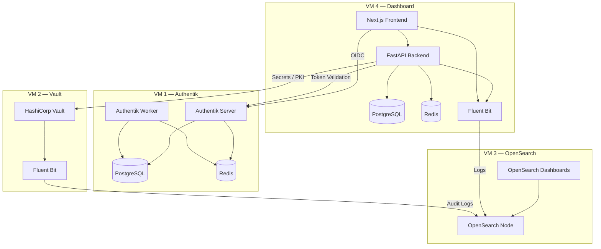
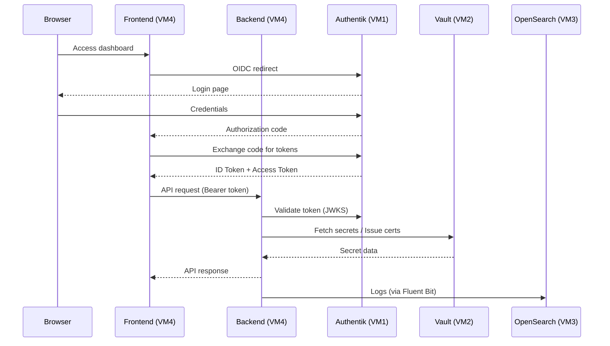

# Component Architecture

## System Overview



---

## VM Specifications

| VM | Role | vCPU | RAM | Storage | Key Services |
|---|---|---|---|---|---|
| VM 1 | Identity Provider | 2 | 4 GB | 40 GB | Authentik Server, Worker, PostgreSQL, Redis |
| VM 2 | Secrets Manager | 2 | 2 GB | 20 GB | HashiCorp Vault, Fluent Bit |
| VM 3 | Log Analytics | 4 | 16 GB | 100 GB | OpenSearch, OpenSearch Dashboards |
| VM 4 | Application | 4 | 8 GB | 60 GB | Next.js, FastAPI, PostgreSQL, Redis, Fluent Bit |

**Total:** 12 vCPU, 30 GB RAM, 220 GB Storage

---

## Service Inventory

### VM 1 — Authentik

| Container | Image | Port | Purpose |
|---|---|---|---|
| `server` | `ghcr.io/goauthentik/server` | 9000 | OIDC Provider, Admin UI |
| `worker` | `ghcr.io/goauthentik/server` | — | Background task processing |
| `postgresql` | `docker.io/library/postgres:16-alpine` | 5432 | Authentik data store |
| `redis` | `docker.io/library/redis:alpine` | 6379 | Session cache, task queue |

### VM 2 — Vault

| Process | Package | Port | Purpose |
|---|---|---|---|
| `vault` | HashiCorp Vault (apt) | 8200 | Secret management, PKI CA |
| `fluent-bit` | Fluent Bit (apt) | — | Vault audit log forwarding |

### VM 3 — OpenSearch

| Container | Image | Port | Purpose |
|---|---|---|---|
| `opensearch-node1` | `opensearchproject/opensearch:2.20.1` | 9200 | Search & analytics engine |
| `opensearch-dashboards` | `opensearchproject/opensearch-dashboards:2.20.1` | 5601 | Visualization UI |

### VM 4 — Orcastra Dashboard

| Container | Image | Port | Purpose |
|---|---|---|---|
| `postgres` | `postgres:17-alpine` | 5432 | Application database |
| `redis` | `redis:8-alpine` | 6379 | Cache, rate limiting |
| `backend` | `svlct/orcastra-dashboard:backend-*` | 8765 → 4050 | REST API (FastAPI) |
| `frontend` | `svlct/orcastra-dashboard:frontend-*` | 4321 → 2025 | Web UI (Next.js) |
| `fluent-bit` | `fluent/fluent-bit:4.2.2-debug` | 2020 | Log collection sidecar |

---

## Inter-VM Communication



---

## Data Flow

### Request Path

```
Browser → Frontend (Next.js) → Backend (FastAPI) → PostgreSQL / Redis / Vault
```

### Authentication Path

```
Browser → Frontend → Authentik (OIDC) → Frontend (callback) → Backend (token validation)
```

### Logging Path

```
Backend/Frontend (stdout) → Docker log driver → Fluent Bit (tail) → OpenSearch
Vault (audit log file) → Fluent Bit (tail) → OpenSearch
```
