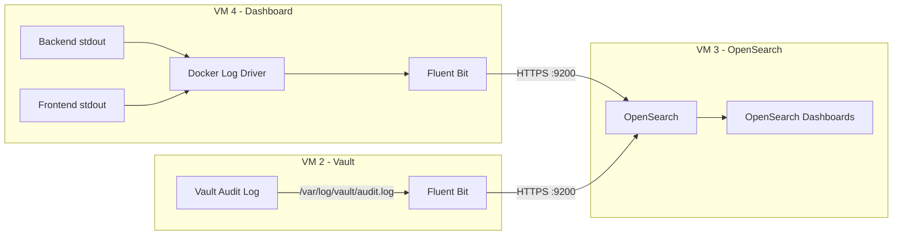

# Logging Architecture

## Three-Tier Log Separation

Orcastra implements a structured logging pipeline that separates logs into three tiers with different retention policies:

| Log Type | Index Pattern | Retention | Purpose |
|---|---|---|---|
| **Access Logs** | `orcastra-access-*` | 90 days | HTTP request/response tracking |
| **Audit Logs** | `orcastra-audit-*` | 3 years | Security and compliance events |
| **Application Logs** | `orcastra-app-*` | 30 days | Debug and operational logs |
| **Vault Audit** | `vault-audit-*` | 3 years | Vault API operation history |

---

## Pipeline Architecture



---

## Fluent Bit Processing

### VM 4 - Dashboard Sidecar

The Fluent Bit container on VM 4 reads Docker container logs and routes them:

```
Docker container stdout → /var/lib/docker/containers/*/*.log
                        ↓
                   [INPUT: tail]
                        ↓
                   [FILTER: nest] - lift nested "log" field
                        ↓
                   [FILTER: modify] - add environment, cluster, collector tags
                        ↓
                   [FILTER: rewrite_tag] - route by log_type:
                        ├── log_type=access → tag: log.access
                        ├── log_type=audit  → tag: log.audit
                        └── level=*         → tag: log.app
                        ↓
                   [OUTPUT: opensearch] - write to OpenSearch indices
```

### Tag-Based Routing

| Source Field | Value | Rewritten Tag | OpenSearch Index |
|---|---|---|---|
| `log_type` | `access` | `log.access` | `orcastra-access-YYYY.MM.DD` |
| `log_type` | `audit` | `log.audit` | `orcastra-audit-YYYY.MM.DD` |
| `level` | any | `log.app` | `orcastra-app-YYYY.MM.DD` |
| `message` | any (fallback) | `log.app` | `orcastra-app-YYYY.MM.DD` |

### VM 2 - Vault Log Forwarding

Fluent Bit on VM 2 is installed as a system service (not Docker). It tails the Vault audit log file and forwards each entry to OpenSearch.

### Reliability and Backpressure

Fluent Bit is configured for enterprise-grade durability so multi-day OpenSearch outages do not silently drop logs:

| Setting | Value | Why |
|---|---|---|
| `Retry_Limit` | `no_limits` (every output, both the VM 4 and VM 2 forwarders) | Audit logs must never be dropped (compliance); access/app and the VM 2 Vault forwarder inherit the same policy. |
| `storage.type filesystem` (per input) | enabled | Buffered chunks survive container restarts. |
| `storage.backlog.mem_limit` | `512M` | Headroom for in-flight retries during transient slowness. |
| `storage.total_limit_size` (per output) | audit `8G`, app `4G`, access `2G` | Per-stream disk backlog ceiling, audit gets the largest budget. |
| `net.connect_timeout` / `net.keepalive` | `10s` / on | Detect stalled OpenSearch connections quickly. |
| `HC_Errors_Count` / `HC_Retry_Failure_Count` | `5` over `60s` | Fluent Bit `/api/v1/health` flips red on shipping failures, Docker marks the container unhealthy and restarts it. |

The logging healthcheck is documented as a self-contained helper script in [Operations → Troubleshooting](../operations/troubleshooting.md#fluent-bit-cannot-write-to-opensearch). Copy it to each VM and wire it to cron or your alerting system.

---

## OpenSearch Index Management

### Index Templates

Three index templates are configured on VM 3 to define field mappings:

- **`orcastra-access-template`** maps HTTP fields: `method`, `path`, `status_code`, `latency_ms`, `client.ip`, `client.user_agent`
- **`orcastra-audit-template`** maps audit fields: `action`, `category`, `actor.user_id`, `target.type`, `target.id`, `result`
- **`vault-audit-template`** maps Vault fields: `type`, `auth.client_token`, `request.operation`, `request.path`

### ISM (Index State Management) Policies

Retention runs automatically through four ISM policies created during VM 3 setup
(see [Step 11](../deployment/vm3-opensearch.md#step-11-create-ism-retention-policies)).
Each policy attaches to new indices through its `ism_template` (matched by index
pattern) at creation time, so the date-based indices Fluent Bit writes pick up
their lifecycle with no manual step. States advance by index age (`min_index_age`),
and every index is snapshotted to the `orcastra-archive` repository before it is
deleted.

=== "Access Logs (90 days)"

    ```
    hot     0-7d       ingesting (also rolls to warm at 50 GB)
    warm    7-85d      force_merge to 1 segment, read-only
    archive 85-90d     snapshot to orcastra-archive
    delete  90d+       delete
    ```

=== "Audit Logs (3 years)"

    ```
    hot     0-30d      ingesting (also rolls to warm at 50 GB)
    warm    30-180d    force_merge to 1 segment, read-only
    cold    180-1080d  read-only
    archive 1080-1095d snapshot to orcastra-archive
    delete  1095d+     delete
    ```

=== "App Logs (30 days)"

    ```
    hot     0-7d       ingesting
    warm    7-25d      force_merge to 1 segment, read-only
    archive 25-30d     snapshot to orcastra-archive
    delete  30d+       delete
    ```

=== "Vault Audit (3 years)"

    ```
    hot     0-30d      ingesting
    warm    30-180d    force_merge to 1 segment, read-only
    cold    180-1080d  read-only
    archive 1080-1095d snapshot to orcastra-archive
    delete  1095d+     delete
    ```

The canonical policy definitions live with the deployment under
`infrastructure/opensearch/ism-policies/`. Because attachment is by index pattern,
the policy must exist before the first matching index is created; the deployment
order applies policies prior to log forwarding.

---

## OpenSearch Security Model

### Users

| User | Role | Purpose |
|---|---|---|
| `admin` | All access | Administrative operations, dashboard import |
| `fluentbit` | `log_writer` | Write-only access to `orcastra-*` and `vault-audit-*` indices |
| `audit_viewer` | `audit_reader` | Read-only access to audit indices |
| `kibanaserver` | (built-in) | OpenSearch Dashboards internal user |

!!! warning "Per-user unique bcrypt hashes"
    Every internal user MUST have a unique bcrypt hash. Do not depend on a repo
    helper script being present on the target VM. Generate each hash locally,
    then write `internal_users.yml` by hand from the deployment guide.

### Fluent Bit Writer Role

```yaml
log_writer:
  cluster_permissions:
    - cluster_composite_ops    # bulk writes authorize at cluster scope first
    - cluster_monitor
    - "cluster:admin/ingest/pipeline/put"
    - "cluster:admin/ingest/pipeline/get"
    - "indices:admin/template/get"
    - "indices:admin/template/put"
  index_permissions:
    - index_patterns: ["orcastra-access-*", "orcastra-audit-*", "orcastra-app-*", "vault-audit-*"]
      allowed_actions: ["crud", "create_index", "manage", "indices:admin/mapping/auto_put"]
```

---

## Dashboard Templates

Pre-built OpenSearch Dashboards are imported during VM 3 setup:

| Dashboard | Description |
|---|---|
| Access Logs | HTTP request analytics, status codes, latency, top endpoints |
| Audit Logs | Security event timeline, user actions, RBAC changes |
| Logs Overview | Combined view across all log types |
| Vault Audit | Vault API operations, secret access, authentication events |
