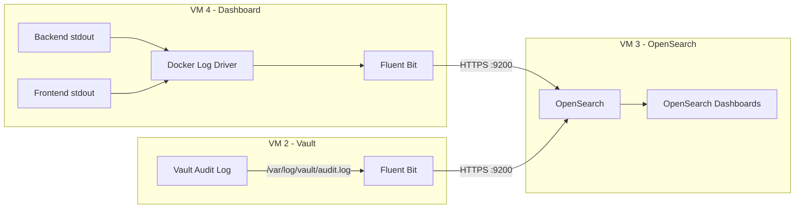

# Logging Architecture

## Three-Tier Log Separation

Orcastra implements a structured logging pipeline that separates logs into three tiers with different retention policies:

| Log Type | Index Pattern | Retention | Purpose |
|---|---|---|---|
| **Access Logs** | `orcastra-access-*` | 90 days | HTTP request/response tracking |
| **Audit Logs** | `orcastra-audit-*` | 3 years | Security and compliance events |
| **Application Logs** | `orcastra-app-*` | 30 days | Debug and operational logs |
| **Vault Audit** | `vault-audit-*` | 1 year | Vault API operation history |

---

## Pipeline Architecture



---

## Fluent Bit Processing

### VM 4 - Dashboard Sidecar

The Fluent Bit container on VM 4 reads Docker container logs and routes them:

```
Docker container stdout → /var/lib/docker/containers/*/*.log
                        ↓
                   [INPUT: tail]
                        ↓
                   [FILTER: nest] - lift nested "log" field
                        ↓
                   [FILTER: modify] - add environment, cluster, collector tags
                        ↓
                   [FILTER: rewrite_tag] - route by log_type:
                        ├── log_type=access → tag: log.access
                        ├── log_type=audit  → tag: log.audit
                        └── level=*         → tag: log.app
                        ↓
                   [OUTPUT: opensearch] - write to OpenSearch indices
```

### Tag-Based Routing

| Source Field | Value | Rewritten Tag | OpenSearch Index |
|---|---|---|---|
| `log_type` | `access` | `log.access` | `orcastra-access-YYYY.MM.DD` |
| `log_type` | `audit` | `log.audit` | `orcastra-audit-YYYY.MM.DD` |
| `level` | any | `log.app` | `orcastra-app-YYYY.MM.DD` |
| `message` | any (fallback) | `log.app` | `orcastra-app-YYYY.MM.DD` |

### VM 2 - Vault Log Forwarding

Fluent Bit on VM 2 is installed as a system service (not Docker). It tails the Vault audit log file and forwards each entry to OpenSearch.

---

## OpenSearch Index Management

### Index Templates

Three index templates are configured on VM 3 to define field mappings:

- **`orcastra-access-template`** - Maps HTTP fields: `method`, `path`, `status_code`, `latency_ms`, `client_ip`, `user_agent`
- **`orcastra-audit-template`** - Maps audit fields: `event_type`, `action`, `actor`, `resource_type`, `resource_id`, `result`
- **`vault-audit-template`** - Maps Vault fields: `type`, `auth.client_token`, `request.operation`, `request.path`

### ISM (Index State Management) Policies

Automatic lifecycle management for each index type:

=== "Access Logs (90 days)"

    ```
    hot    → 0-7 days    → 1 replica, priority 100
    warm   → 7-30 days   → force merge to 1 segment, read-only
    cold   → 30-90 days  → read-only
    delete → 90+ days    → auto-delete
    ```

=== "Audit Logs (3 years)"

    ```
    hot    → 0-30 days   → 1 replica, priority 100
    warm   → 30-180 days → force merge, read-only
    cold   → 180 days-3yr → read-only
    delete → 3+ years    → auto-delete
    ```

=== "App Logs (30 days)"

    ```
    hot    → 0-7 days    → 1 replica
    warm   → 7-30 days   → force merge, read-only
    delete → 30+ days    → auto-delete
    ```

=== "Vault Audit (1 year)"

    ```
    hot    → 0-30 days   → 1 replica
    warm   → 30-180 days → force merge, read-only
    cold   → 180 days-1yr → read-only
    delete → 1+ year     → auto-delete
    ```

---

## OpenSearch Security Model

### Users

| User | Role | Purpose |
|---|---|---|
| `admin` | All access | Administrative operations, dashboard import |
| `fluentbit` | `fluentbit_writer` | Write-only access to `orcastra-*` and `vault-audit-*` indices |

### Fluent Bit Writer Role

```yaml
fluentbit_writer:
  index_permissions:
    - index_patterns: ["orcastra-*", "vault-audit-*"]
      allowed_actions:
        - crud
        - create_index
        - manage
```

---

## Dashboard Templates

Pre-built OpenSearch Dashboards are imported during VM 3 setup:

| Dashboard | Description |
|---|---|
| Access Logs | HTTP request analytics - status codes, latency, top endpoints |
| Audit Logs | Security event timeline - user actions, RBAC changes |
| Logs Overview | Combined view across all log types |
| Vault Audit | Vault API operations - secret access, authentication events |
