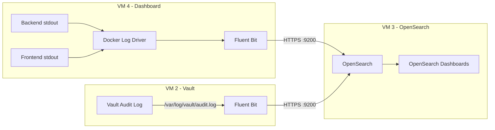

# Logging Architecture

## Three-Tier Log Separation

Orcastra implements a structured logging pipeline that separates logs into three tiers with different retention policies:

| Log Type | Index Pattern | Retention | Purpose |
|---|---|---|---|
| **Access Logs** | `orcastra-access-*` | 90 days | HTTP request/response tracking |
| **Audit Logs** | `orcastra-audit-*` | 3 years | Security and compliance events |
| **Application Logs** | `orcastra-app-*` | 30 days | Debug and operational logs |
| **Vault Audit** | `vault-audit-*` | 3 years | Vault API operation history |

---

## Pipeline Architecture


```mermaid
graph LR
    subgraph VM4["VM 4 - Dashboard"]
        BE[Backend stdout]
        FE[Frontend stdout]
        DOCKER[Docker Log Driver]
        FB4[Fluent Bit]
        BE --> DOCKER
        FE --> DOCKER
        DOCKER --> FB4
    end

    subgraph VM2["VM 2 - Vault"]
        VAULT[Vault Audit Log]
        FB2[Fluent Bit]
        VAULT -->|/var/log/vault/audit.log| FB2
    end

    subgraph VM3["VM 3 - OpenSearch"]
        OS[OpenSearch]
        OSD[OpenSearch Dashboards]
        OS --> OSD
    end

    FB4 -->|HTTPS :9200| OS
    FB2 -->|HTTPS :9200| OS
```

---

## Fluent Bit Processing

### VM 4 - Dashboard Sidecar

The Fluent Bit container on VM 4 reads Docker container logs and routes them:

```
Docker container stdout → /var/lib/docker/containers/*/*.log
                        ↓
                   [INPUT: tail]
                        ↓
                   [FILTER: nest] - lift nested "log" field
                        ↓
                   [FILTER: modify] - add environment, cluster, collector tags
                        ↓
                   [FILTER: rewrite_tag] - route by log_type:
                        ├── log_type=access → tag: log.access
                        ├── log_type=audit  → tag: log.audit
                        └── level=*         → tag: log.app
                        ↓
                   [OUTPUT: opensearch] - write to OpenSearch indices
```

### Tag-Based Routing

| Source Field | Value | Rewritten Tag | OpenSearch Index |
|---|---|---|---|
| `log_type` | `access` | `log.access` | `orcastra-access-YYYY.MM.DD` |
| `log_type` | `audit` | `log.audit` | `orcastra-audit-YYYY.MM.DD` |
| `level` | any | `log.app` | `orcastra-app-YYYY.MM.DD` |
| `message` | any (fallback) | `log.app` | `orcastra-app-YYYY.MM.DD` |

### VM 2 - Vault Log Forwarding

Fluent Bit on VM 2 is installed as a system service (not Docker). It tails the Vault audit log file and forwards each entry to OpenSearch.

### Reliability and Backpressure

Fluent Bit is configured for enterprise-grade durability so multi-day OpenSearch outages do not silently drop logs:

| Setting | Value | Why |
|---|---|---|
| `Retry_Limit` | `no_limits` (every output, both the VM 4 and VM 2 forwarders) | Audit logs must never be dropped (compliance); access/app and the VM 2 Vault forwarder inherit the same policy. |
| `storage.type filesystem` (per input) | enabled | Buffered chunks survive container restarts. |
| `storage.backlog.mem_limit` | `512M` | Headroom for in-flight retries during transient slowness. |
| `storage.total_limit_size` (per output) | audit `8G`, app `4G`, access `2G` | Per-stream disk backlog ceiling, audit gets the largest budget. |
| `net.connect_timeout` / `net.keepalive` | `10s` / on | Detect stalled OpenSearch connections quickly. |
| `HC_Errors_Count` / `HC_Retry_Failure_Count` | `5` over `60s` | Fluent Bit `/api/v1/health` flips red on shipping failures, Docker marks the container unhealthy and restarts it. |

The logging healthcheck is documented as a self-contained helper script in [Operations → Troubleshooting](../operations/troubleshooting.md#fluent-bit-cannot-write-to-opensearch). Copy it to each VM and wire it to cron or your alerting system.

---

## OpenSearch Index Management

### Monthly Indices

Fluent Bit writes Logstash-style daily names (`orcastra-access-2026.10.04`). The index template of
each log type sets an ingest `default_pipeline` that routes the document to the **monthly** index
(`orcastra-access-2026.10`), so shippers need no change and the single node stays far below its
1000-shard limit. One daily index per log type would reach that limit in well under a year.

| Index | Writer | Notes |
|---|---|---|
| `orcastra-access-YYYY.MM` | VM 4 Fluent Bit | HTTP request log |
| `orcastra-audit-YYYY.MM` | VM 4 Fluent Bit | `event_id` as document ID, so a resend never duplicates |
| `orcastra-app-YYYY.MM` | VM 4 Fluent Bit | application log |
| `vault-audit-YYYY.MM` | VM 2 Fluent Bit | parsed by the `vault-audit-parse` pipeline |
| `containers-<stack>-<env>-YYYY.MM` | per-stack Fluent Bit | Docker logs of other stacks, see below |
| `security-auditlog-YYYY.MM` | OpenSearch security plugin | authentication and permission events |

All templates use one shard and no replica (single node). Templates and pipelines are versioned
in `orcastra-cmp/deploy/logging/opensearch/` and applied with `scripts/apply-ingest-config.sh`.

### Index Templates

- **`orcastra-access-template`** maps HTTP fields: `method`, `path`, `status_code`, `latency_ms`, `client.ip`, `client.user_agent`
- **`orcastra-audit-template`** maps audit fields: `action`, `category`, `actor.user_id`, `target.type`, `target.id`, `result` (`event_id` is the document ID)
- **`orcastra-app-template`**: settings only, dynamic mapping
- **`vault-audit-template`** maps Vault fields: `type`, `auth.client_token`, `request.operation`, `request.path`
- **`containers-template`**: fixed fields (`stack`, `env`, `host`, `container_name`, `compose_project`,
  `compose_service`, `image`, `level`, `message`, `request_id`); any other JSON key a container logs
  is stored in the `flat_object` field `fields` and searchable as `fields.<key>`. This keeps a stack
  with many different log formats from exploding the mapping or having documents rejected for
  type conflicts.

### Retention (ISM)

Retention targets per log type:

| Log type | Target |
|---|---|
| Access | 90 days |
| Audit | 3 years |
| App | 30 days |
| Vault audit | 3 years |

Each index is snapshotted to the `orcastra-archive` repository before it is deleted.

!!! warning "Not enforced on the production cluster yet"
    No ISM policy is attached on the production logging host (verified 2026-10-05), so indices
    are kept until removed.

    Policies that advance by `min_index_age` and set `read_only` after 7 to 30 days were written
    for daily indices. They must not be attached to the monthly layout: the current month's index
    is still being written, and a read-only block stops ingestion mid-month. Index age also counts
    from index creation, and the monthly indices produced by the 2026-10 consolidation were all
    created on that day. Retention for monthly indices goes by the month in the index name (an
    index is removed once its whole month is older than the target) and ships with the deployment
    bundle in `orcastra-cmp/deploy/logging/` once enabled.

---

## Container Logs From Other Stacks

The same OpenSearch can hold the Docker container logs of other stacks running alongside
Orcastra, so audit and troubleshooting use one place. Each stack gets a write-only account that
can create and write only `containers-<stack>-<env>-*`; it cannot read, delete, or touch any
other index. Logs are shipped with TLS verification against the logging CA, either by the
generic shipper in `orcastra-cmp/deploy/logging/shipper/` (a Fluent Bit that tails every Docker
`json-file` log on the host and adds container and compose metadata, without touching the
application containers) or by a Fluent Bit the stack already runs. The procedure is in
`orcastra-cmp/deploy/logging/docs/onboarding-a-stack.md`.

The **Container Logs** dashboard (Global tenant) shows volume, levels and errors per stack, host
and container, with the raw lines below. JSON log lines are parsed on ingest, and the level is
recognised in common plain-text formats, so the level filter works across very different
containers.

---

## OpenSearch Security Model

### People (SSO)

Users sign in to OpenSearch Dashboards with Authentik. Membership of the Authentik group
`opensearch-admins` grants full access; `opensearch-viewers` grants read-only access. Users in
neither group are refused by Authentik. Tokens are bound to the OpenSearch Dashboards provider
(issuer and audience checks), so a token issued for another application is not accepted.

### Internal Users

| User | Role | Purpose |
|---|---|---|
| `admin` | `all_access` | Break-glass sign-in and administrative API calls |
| `kibanaserver` | (built-in) | OpenSearch Dashboards internal user |
| `fluentbit` | `log_writer` | VM 2 and VM 4 shippers: `orcastra-*`, `vault-audit-*` |
| `audit_viewer` | `audit_reader` | Read-only access to audit indices |
| `fluentbit-<stack>-<env>` | `writer_<stack>_<env>` | Container logs of one stack and environment, write-only |

Internal users are managed through the security REST API (`scripts/provision-stack.sh` for
writers); password hashes are not kept in files.

### Fluent Bit Writer Role (VM 2, VM 4)

As deployed (`orcastra-cmp/deploy/logging/opensearch/security/roles.yml`). `manage` covers the
mapping updates dynamic fields need (`indices:admin/mapping/auto_put` in OpenSearch 3.x):

```yaml
log_writer:
  cluster_permissions: ["cluster_monitor", "cluster_composite_ops"]
  index_permissions:
    - index_patterns: ["orcastra-access-*", "orcastra-audit-*", "orcastra-app-*", "vault-audit-*"]
      allowed_actions: ["crud", "create_index", "manage"]
```

---

## Dashboard Templates

Pre-built OpenSearch Dashboards are imported during VM 3 setup:

| Dashboard | Description |
|---|---|
| Access Logs | HTTP request analytics, status codes, latency, top endpoints |
| Audit Logs | Security event timeline, user actions, RBAC changes |
| Logs Overview | Combined view across all log types |
| Vault Audit | Vault API operations, secret access, authentication events |
