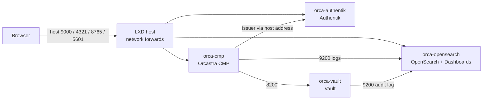

# Automated Install

**One command on an LXD host builds the whole four-instance deployment: the instances,
their private addresses, SSH access, per-instance firewalls, Authentik, Vault, OpenSearch,
the Orcastra CMP, the port forwards browsers use, and a watchdog that unseals Vault after a
restart.** It ends by checking every layer and prints where everything is. The
[manual guides](index.md) describe the same deployment step by step and stay the reference
for understanding or customizing each component.

---

## Before you start

The installer runs on the LXD host itself, as root.

| Requirement | Details |
|---|---|
| Host OS | Ubuntu 22.04 or 24.04. Other distributions get a warning and are untested |
| LXD | 5.0 or newer, initialized (`lxd init`), with a storage pool and a managed bridge. The installer can create a new pool or bridge for you |
| Python | 3.8 or newer (`python3`), standard library only, nothing to `pip install` |
| Host tools | `ip`, `ss`, `openssl`, `ssh`, `ssh-keygen` |
| Virtual machines | `/dev/kvm` on the host. Without it, choose container instances |
| Outbound internet | From the instances, for Ubuntu packages, Docker images (Docker Hub, `ghcr.io`) and the HashiCorp and Fluent Bit apt repositories |

Sizing is chosen in the wizard:

| Profile | orca-authentik | orca-vault | orca-opensearch | orca-cmp | Total |
|---|---|---|---|---|---|
| compact | 2 vCPU, 3 GiB, 20 GiB | 1, 1, 10 | 2, 6, 40 | 2, 4, 30 | 7 vCPU, 14 GiB, 100 GiB |
| production | 2, 4, 40 | 2, 2, 20 | 4, 16, 100 | 4, 8, 60 | 12 vCPU, 30 GiB, 220 GiB |
| custom | asked per instance, with a floor per component | | | | |

Production follows the [prerequisites](../getting-started/prerequisites.md). Compact fits a
host with 16 GB of RAM. The wizard refuses a plan that does not fit the host's memory or a
`dir` pool's free space, and warns when CPUs are overcommitted.

## Run it

```bash
curl -fsSL https://raw.githubusercontent.com/sctsivali/orcastra-docs/main/installer/get-full.sh | sudo bash
```

The bootstrap downloads the installer from the GitHub release, checks its SHA-256 against the
value pinned in the script (it refuses to run when the check fails), and starts it. Questions
are read from your terminal, so this works through the pipe.

The wizard asks, offering a default for each:

1. instance type: `vm` (default when `/dev/kvm` exists) or `container`
2. storage pool: an existing pool, or a new name (then driver and size)
3. network: a new dedicated bridge by default (`orcastrabr0`, then its gateway and prefix, defaulting to a free `10.x.0.1/24`), or an existing managed bridge
4. a private IPv4 for each instance, defaulting to `.11` to `.14` in that subnet
5. sizing profile
6. the host address browsers will use, chosen from the addresses on the host
7. the host port for each web endpoint (Authentik 9000, CMP 4321, CMP API 8765, OpenSearch Dashboards 5601)
8. the admin email, and whether to type the `akadmin` password or let the installer generate one
9. the Orcastra CMP release: `latest` (1.0.0-RC4-hotfix2) or 1.0.0-RC4-hotfix1. Earlier
   releases are not offered, because their frontend healthcheck follows the sign-in redirect
   to the public URL and the frontend restarts in a loop. When Docker Hub carries a newer
   release than the installer knows, the wizard says so

The installer checks that the chosen release's images exist on Docker Hub before it starts.

Every answer is checked against the live host before anything is created. An address already
leased on the bridge or answering ping, a port something on the host already listens on, a
port already forwarded to another workload, or a subnet that overlaps an existing route is
rejected with the reason, and the question is asked again. A summary of the plan comes last,
and nothing changes until you confirm it.

!!! warning "Plain HTTP"
    The web endpoints are served over plain HTTP on the host address. Keep them on a trusted
    network or behind a VPN, and do not publish that address to the internet as it is.

## Unattended install

Every setting has one key that works as a flag, in an answer file, or as an environment
variable. A flag wins over the answer file, which wins over `ORCASTRA_<KEY>` variables, which
win over the defaults. A key the installer does not know is an error, so a typo cannot be
ignored silently.

```bash title="/root/orcastra.env"
INSTANCE_TYPE=vm
STORAGE_POOL=default
NETWORK=lxdbr0
SIZING=compact
HOST_ADDRESS=192.0.2.10
ADMIN_EMAIL=admin@example.com
CMP_VERSION=latest
ASSUME_YES=yes
```

```bash
curl -fsSL https://raw.githubusercontent.com/sctsivali/orcastra-docs/main/installer/get-full.sh \
  | sudo bash -s -- --answers /root/orcastra.env
```

| Key | Meaning |
|---|---|
| `INSTANCE_TYPE` | `vm` or `container` |
| `LXD_PROJECT` | LXD project for the instances (default `orcastra`) |
| `STORAGE_POOL`, `POOL_DRIVER`, `POOL_SIZE_GIB`, `POOL_SOURCE` | pool to use, or the settings of a new one |
| `NETWORK`, `NETWORK_SUBNET` | bridge to use, or the gateway/prefix of a new one |
| `IP_VAULT`, `IP_AUTHENTIK`, `IP_OPENSEARCH`, `IP_CMP` | private IPv4 per instance |
| `SIZING`, `CPU_<ROLE>`, `MEM_<ROLE>`, `DISK_<ROLE>` | profile, and per-instance overrides in vCPU and GiB |
| `HOST_ADDRESS` | address browsers use |
| `PORT_AUTHENTIK`, `PORT_CMP`, `PORT_API`, `PORT_LOGS` | host ports of the web endpoints |
| `ADMIN_EMAIL`, `ADMIN_PASSWORD` | `akadmin` email and password (password generated when empty, and only accepted from the answer file, never as a flag) |
| `CMP_VERSION` | `latest` or a release such as `1.0.0-RC4-hotfix2` |
| `IMAGE` | LXD image for the instances (default `ubuntu:24.04`) |
| `FIX_HOST_FIREWALL` | `yes`, `no` or `ask`: whether the installer may change host settings, see [Host firewalls](#host-firewalls) |

`--dry-run` runs the host checks and the wizard, prints the plan and exits without creating,
writing or pulling anything.

## What it builds



| Instance | Runs |
|---|---|
| `orca-vault` | Vault 1.21 from the HashiCorp apt repository, integrated raft storage, and Fluent Bit 4.2 shipping the audit log |
| `orca-authentik` | Authentik 2025.10.3 (server, worker, PostgreSQL) in Docker |
| `orca-opensearch` | OpenSearch and OpenSearch Dashboards 3.5.0 in Docker |
| `orca-cmp` | the release `docker-compose.prod.yml`: backend, frontend, PostgreSQL, Redis, Fluent Bit, autoheal |

The instances live in their own LXD project and use an `orcastra` profile (root disk, NIC,
cloud-init). Each one keeps the address you chose through a static DHCP lease, with LXD's MAC
and IPv4 filtering on its NIC so no instance can send with another one's address, starts on boot
(Vault and the stores before the CMP), and carries a `user.orcastra.role` key. Instances are
created one at a time.

Configuration follows the manual guides, and the blocks the guides ask you to type (Vault
policy, OpenSearch security files, pipeline, index templates, ISM policies, Fluent Bit files,
the CMP `.env`) are taken from those pages, so the two paths stay identical. Authentik is
configured through its API instead of the admin UI: the role groups, `akadmin` in
`role_admin`, the OAuth2 provider and application with the exact `orcastra-dashboard` slug,
and the token the CMP uses for role sync.

### Where it differs from the manual guide

| Area | Installer | Why |
|---|---|---|
| Vault storage | integrated `raft` | the guide's `vault.hcl` has no storage stanza |
| Vault dashboard token | periodic (30 days), renewed by the watchdog | a token created with `-ttl=0` gets the 768h default and expires after 32 days |
| OpenSearch TLS | a private CA created on the host, verified by Vault's Fluent Bit and by Dashboards (the CMP's Fluent Bit sidecar keeps `tls.verify Off`, because the release compose only mounts its three config files) | the bundled demo certificates have public private keys |
| Role-sync token | a service account limited to reading users and groups and moving users between the three role groups | the guide uses an `akadmin` token |
| PostgreSQL and Redis on orca-cmp | bound to `127.0.0.1` | published ports bypass the guest firewall |
| Trusted proxies | loopback and the Docker networks only | the guide trusts every private range, so any LAN client could set its own client IP |
| Fluent Bit on orca-vault | Fluent Bit's signed apt repository, pinned version | the guide pipes an install script from `master` |
| Authentik | pinned version, no Docker socket in the worker, only port 9000 published | the guide downloads the latest upstream compose |

## Network, firewall and SSH

Browsers reach the four web endpoints on the host address through LXD network forwards. When
that address already has a forward (another workload), the installer only adds its own ports
to it and records exactly which ones. Vault is never forwarded.

The issuer URL has to be the same for the browser and for the CMP's own containers, so
`orca-cmp` carries a NAT rule that sends traffic for the host address and Authentik port
straight to `orca-authentik`. The CMP reaches the Authentik API, Vault and OpenSearch on their
private addresses.

Each instance runs an nftables firewall (`orcastra-firewall.service`) that trusts only its own
loopback and Docker interfaces and drops new inbound connections on every other interface
except:

| Instance | Allowed in |
|---|---|
| all | SSH from the host only |
| orca-vault | 8200 from orca-cmp and the host |
| orca-opensearch | 9200 from orca-vault, orca-cmp and the host, 5601 from anywhere |
| orca-authentik | 9000 from anywhere |
| orca-cmp | 4321 and 8765 from anywhere |

The rules also cover ports Docker publishes, so a container started later with `-p` is not
reachable unless it is on this list.

The rules fail closed. Docker and Vault require the firewall unit, so they do not start when
the rules could not be loaded, and a network interface that appears later is filtered like the
first one. The host itself is the management point: its bridge address may reach SSH, Vault and
OpenSearch, so keep root on the LXD host to the people who run the platform.

SSH works from the host only. The installer creates a key in `/var/lib/orcastra/ssh/`, puts
the instances' host keys in a dedicated `known_hosts` file (read through `lxc exec`, so the
first connection is already verified), and writes `~/.ssh/config.d/orcastra.conf` with an
`Include` at the top of `~/.ssh/config`:

```bash
ssh orca-vault
ssh orca-cmp
```

Password login is refused and the instances cannot SSH to each other. From a laptop, jump
through the host after adding your public key to the `ubuntu` user of the instance:

```bash
ssh -J you@<host-address> ubuntu@<instance-ip>
```

### Host firewalls

Three host settings break the deployment, and the installer checks for each before creating
anything:

| Finding | What the installer adds |
|---|---|
| iptables `FORWARD` policy `DROP` (set by Docker on the host) | accept rules for the instance bridge in Docker's `DOCKER-USER` chain, kept by `orcastra-host-forward.service` |
| ufw active with a routed deny policy | `ufw allow in on <bridge>` and `ufw route allow` rules for the bridge (without them the instances get no DHCP address) |
| `vm.max_map_count` below 262144, container instances only | `/etc/sysctl.d/60-orcastra.conf` with 262144, which OpenSearch needs because containers share the host kernel |

It lists what it found and asks before changing anything. `FIX_HOST_FIREWALL=yes` applies the
changes in an unattended run, `FIX_HOST_FIREWALL=no` stops the install so you can make them
yourself. Uninstall reverts them (a lowered `vm.max_map_count` returns to its old value at the
next reboot).

## Files and credentials

Everything the installer needs to manage the deployment is under `/var/lib/orcastra/`
(mode 0700):

| Path | Contents |
|---|---|
| `secrets.json` | every generated credential (0600) |
| `vault-init.json` | Vault unseal keys and root token (0600) |
| `credentials.txt` | URLs, `akadmin` and OpenSearch logins (0600) |
| `pki/` | the OpenSearch CA, node and admin certificates |
| `ssh/` | the operator key and `known_hosts` |
| `state.json` | the phase ledger and what was created, used by re-runs and uninstall |
| `install.log` | the run log, with every secret masked |

!!! danger "Back up the Vault keys"
    Copy `vault-init.json` to offline storage right after the install. It is the only way to
    unseal Vault if the host is lost, and losing it means losing every secret Vault holds.

No secret is ever passed on a command line, in the host or in the instances: values travel
on standard input or in 0600 files, and the instances' cloud-init holds only the public SSH
key.

## Vault watchdog

Vault seals itself every time it restarts. The CMP keeps serving the cluster list it read at
its own start, so a sealed Vault breaks cluster registration and certificate issuance
silently. `orcastra-maintain.timer` runs every minute on the host: it unseals Vault with the
keys in `vault-init.json`, restarts the CMP backend so it reloads the clusters, and renews the
dashboard token before it runs low. Its actions go to the journal:

```bash
journalctl -u orcastra-maintain.service
```

## Day-2 commands

The installer stays on the host as `orcastra-full`:

| Command | What it does |
|---|---|
| `orcastra-full status` | instances, container health, Vault seal state, token TTL, certificate expiry |
| `orcastra-full verify` | the full end-to-end check, the same as the last install phase |
| `orcastra-full unseal` | unseal Vault by hand (prompts for keys when they are not on the host) |
| `orcastra-full credentials` | print URLs and logins |
| `orcastra-full uninstall` | remove the deployment (asks you to type `orcastra`) |
| `orcastra-full install` | re-run, resume, or apply a new host address or ports |

## Re-runs and changes

Run the same command again at any time. Finished phases are skipped, and a run that stopped
part way resumes where it stopped. `--repair` re-runs every phase and changes nothing when
nothing needs changing.

The host address and the four host ports can change: re-run with the new values and the
installer updates the issuer, the redirect URI, the CMP URLs, the NAT rule and the forwards.
Settings the instances were built with (instance type, project, pool, network, addresses,
sizes, CMP release) cannot change this way, and the installer refuses rather than leave the
deployment half changed. Uninstall and install again to change them, or resize an instance
with `lxc config set` yourself.

## What the last phase checks

The verification phase (and `orcastra-full verify`) fails the run when any of these fails:

- the four instances run with their addresses, and `ssh` works to each
- the firewall matrix holds, including a probe container published on an unlisted port
- Vault is unsealed on raft, and the dashboard token is periodic, renewable and not root
- OpenSearch is healthy over TLS verified by the private CA, with the four ISM policies and the dashboards, and no demo certificate
- every public URL answers through the forwards, and the issuer seen there matches the CMP's
- a sign-in from the CMP redirects to Authentik's authorize endpoint
- from inside the CMP containers: Vault with the dashboard token, the Authentik API with the role-sync token, and the issuer through the NAT rule
- the Vault audit log and the CMP logs arrive in OpenSearch

## Uninstall

```bash
orcastra-full uninstall
```

It deletes the four instances and all their data, the forwards or ports it added, the profile
and project, and the pool and bridge only when it created them and nothing else uses them. It
also removes the timer, the `orcastra-full` command, the SSH entries and any host firewall
rules it added. `--keep-secrets` keeps `/var/lib/orcastra` under a dated name instead of
deleting it.

## Troubleshooting

| Symptom | Cause and fix |
|---|---|
| `LXD is slow to answer` in the log | the LXD API took over two minutes on one call. The installer retries, but a host whose LXD log shows database timeouts needs attention first |
| `Image pull failed ... rate limit` | Docker Hub's anonymous pull limit. Wait, or run `docker login` inside the instance, then re-run |
| `has no working DNS or internet egress` | NAT on the bridge, or a host firewall. See [Host firewalls](#host-firewalls) |
| `Vault is already initialized but its unseal keys are not on this host` | restore `vault-init.json`, or delete `orca-vault` and re-run |
| `These settings cannot change once instances exist` | see [Re-runs and changes](#re-runs-and-changes) |
| A login loop or an issuer error after changing the host address | re-run the installer with the new address so every URL is updated together |
