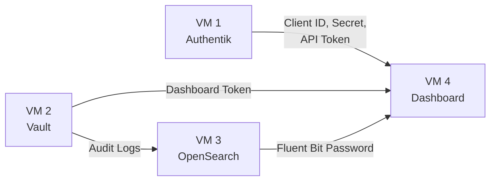

# Deployment Guide

This section provides step-by-step instructions for deploying each Orcastra platform component across four virtual machines.

## Deployment Order

!!! warning "Sequential Deployment Required"
    Deploy in the order below. Each VM depends on configuration values generated by the previous VM.



## VM Overview

| Guide | Component | Purpose |
|---|---|---|
| [VM 1 — Authentik](vm1-authentik.md) | Authentik SSO | Identity provider, OAuth2/OIDC, role groups |
| [VM 2 — Vault](vm2-vault.md) | HashiCorp Vault | Secret engine, PKI CA, audit logging |
| [VM 3 — OpenSearch](vm3-opensearch.md) | OpenSearch | Log aggregation, dashboards, index templates |
| [VM 4 — Dashboard](vm4-dashboard.md) | Orcastra Dashboard | Web application, API, Fluent Bit sidecar |

## Common: Docker Installation

VMs 1, 3, and 4 require Docker. The installation steps below are referenced by each guide.

### Add Docker Repository

```bash
# Add Docker's official GPG key
sudo apt update
sudo apt install ca-certificates curl
sudo install -m 0755 -d /etc/apt/keyrings
sudo curl -fsSL https://download.docker.com/linux/ubuntu/gpg \
  -o /etc/apt/keyrings/docker.asc
sudo chmod a+r /etc/apt/keyrings/docker.asc

# Add the repository to Apt sources
sudo tee /etc/apt/sources.list.d/docker.sources <<EOF
Types: deb
URIs: https://download.docker.com/linux/ubuntu
Suites: $(. /etc/os-release && echo "${UBUNTU_CODENAME:-$VERSION_CODENAME}")
Components: stable
Signed-By: /etc/apt/keyrings/docker.asc
EOF
```

### Install Docker Engine

```bash
sudo apt update
sudo apt install docker-ce docker-ce-cli containerd.io \
  docker-buildx-plugin docker-compose-plugin
```

### Verify Installation

```bash
sudo systemctl status docker
```

!!! tip "Network Issues"
    If you see `curl: (6) Could not resolve host: download.docker.com`, retry the command. DNS resolution in LXD containers may take a moment after boot.

!!! note "LXD Overlay Storage Fix"
    If `docker compose up -d` fails with a mount error, install `fuse-overlayfs` and configure Docker:

    ```bash
    apt-get update && apt-get install fuse-overlayfs -y
    cat > /etc/docker/daemon.json <<EOF
    {
      "storage-driver": "fuse-overlayfs"
    }
    EOF
    systemctl restart docker
    ```
