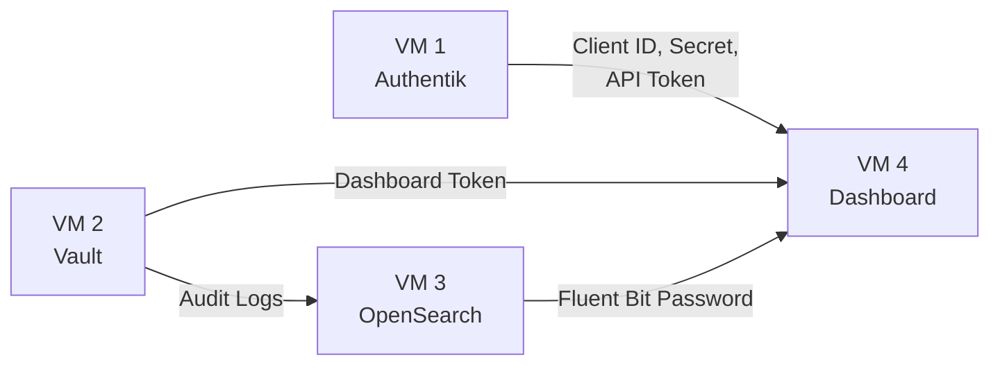

# Deployment Guide

This section provides step-by-step instructions for deploying each Orcastra platform component across four virtual machines.

!!! tip "Automated install"
    On an LXD host, the [automated installer](automated-install.md) builds all four
    instances and runs every step below in one command, including the cross-VM values.

## Deployment Order

!!! warning "Sequential Deployment Required"
    Each VM depends on values generated by an earlier one, and VM 2 is finished in two
    passes because its Fluent Bit needs the password VM 3 creates:

    1. [VM 1 - Authentik](vm1-authentik.md)
    2. [VM 2 - Vault](vm2-vault.md), Steps 1 to 6
    3. [VM 3 - OpenSearch](vm3-opensearch.md), including the index templates and ISM
       policies, so they exist before the first log arrives
    4. VM 2, [Step 7 (Fluent Bit)](vm2-vault.md#step-7-install-fluent-bit)
    5. [VM 4 - Orcastra CMP](vm4-dashboard.md)


```mermaid
graph LR
    A["VM 1<br/>Authentik"] -->|Client ID, Secret,<br/>API Token| D["VM 4<br/>Dashboard"]
    B["VM 2<br/>Vault"] -->|Dashboard Token| D
    B -->|Audit Logs| C["VM 3<br/>OpenSearch"]
    C -->|Fluent Bit Password| D
```

## VM Overview

| Guide | Component | Purpose |
|---|---|---|
| [VM 1 - Authentik](vm1-authentik.md) | Authentik SSO | Identity provider, OAuth2/OIDC, role groups |
| [VM 2 - Vault](vm2-vault.md) | HashiCorp Vault | Secret engine, PKI CA, audit logging |
| [VM 3 - OpenSearch](vm3-opensearch.md) | OpenSearch | Log aggregation, dashboards, index templates |
| [VM 4 - Dashboard](vm4-dashboard.md) | Orcastra CMP | Web application, API, Fluent Bit sidecar |

## Common: Docker Installation

VMs 1, 3, and 4 require Docker. The installation steps below are referenced by each guide.

### Add Docker Repository

```bash
# Add Docker's official GPG key
sudo apt update
sudo apt install ca-certificates curl
sudo install -m 0755 -d /etc/apt/keyrings
sudo curl -fsSL https://download.docker.com/linux/ubuntu/gpg \
  -o /etc/apt/keyrings/docker.asc
sudo chmod a+r /etc/apt/keyrings/docker.asc

# Add the repository to Apt sources
sudo tee /etc/apt/sources.list.d/docker.sources <<EOF
Types: deb
URIs: https://download.docker.com/linux/ubuntu
Suites: $(. /etc/os-release && echo "${UBUNTU_CODENAME:-$VERSION_CODENAME}")
Components: stable
Signed-By: /etc/apt/keyrings/docker.asc
EOF
```

### Install Docker Engine

```bash
sudo apt update
sudo apt install docker-ce docker-ce-cli containerd.io \
  docker-buildx-plugin docker-compose-plugin
```

### Verify Installation

```bash
sudo systemctl status docker
```

!!! tip "Network Issues"
    If you see `curl: (6) Could not resolve host: download.docker.com`, retry the command. DNS resolution in LXD containers may take a moment after boot.

!!! note "LXD Overlay Storage Fix"
    If `docker compose up -d` fails with a mount error, install `fuse-overlayfs` and configure Docker:

    ```bash
    apt-get update && apt-get install fuse-overlayfs -y
    cat > /etc/docker/daemon.json <<EOF
    {
      "storage-driver": "fuse-overlayfs"
    }
    EOF
    systemctl restart docker
    ```
