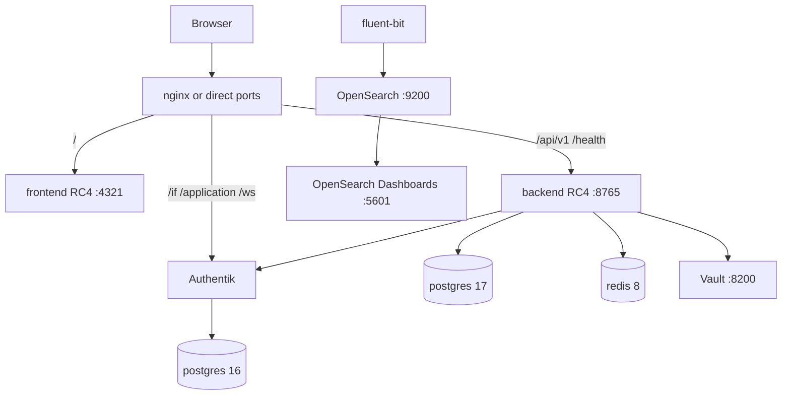

# Lab: Orcastra di satu komputer (Docker)

Panduan ini menjelaskan cara menjalankan **platform Orcastra lengkap** — Dashboard + Authentik + Vault + OpenSearch — di **satu komputer** sampai login lewat Authentik berhasil.

Status acuan: lab box `/workspace/orcastra` (project Compose `orcastra`), **13 service**, image ter-pin, **1 Sep 2026**.

Teks ini bahasa Indonesia (nubi-jelas). Compose sanitasi ada di [`lab/docker-compose.yml`](lab/docker-compose.yml).

!!! warning "Ini bukan Mini, dan bukan 4-VM produksi"
    - **Orcastra Mini** = satu host, login sertifikat TLS client, **tanpa** Authentik dan **tanpa** OpenSearch. Lihat [Orcastra Mini](../mini/index.md).
    - **4-VM produksi** (VM1–VM4 di situs ini) = Authentik, Vault, OpenSearch, Dashboard masing-masing di mesin sendiri.
    - **Lab ini** = semua digabung di satu Docker Compose. Cocok untuk tes/nubi, **bukan** layout produksi.

SSO-only di laptop (branding Authentik, tanpa Dashboard/Vault/OpenSearch) ada di [orcastra-authentik-theme `docs/00-docker-lokal.md`](https://github.com/sctsivali/orcastra-authentik-theme/blob/main/docs/00-docker-lokal.md). Lab Authentik di sini **2026.8.0**, bukan 2026.2.1 yang dipakai produksi SSO.

---

## Yang kamu butuhkan

| Hal | Lab (cukup) | Catatan |
|---|---|---|
| Docker Compose | plugin **v2** (`docker compose`, bukan `docker-compose` v1) | |
| CPU | ~2 vCPU | backend lab dibatasi 1 CPU |
| RAM | banyak | OpenSearch paling berat; lab menurunkan heap ke **512m** (`OPENSEARCH_JAVA_OPTS=-Xms512m -Xmx512m`) |
| Disk | longgar | image + volume OpenSearch cepat penuh |
| Browser | Chrome/Firefox | |

Instal Docker Engine + compose plugin seperti di [Common: Docker Installation](index.md#common-docker-installation).

---

## Kenapa satu compose?

Compose produk `docker-compose.prod.yml` **hanya Dashboard** (postgres, redis, backend, frontend, fluent-bit, autoheal). Ia menganggap Authentik, Vault, dan OpenSearch sudah hidup di VM lain.

Lab menggabungkan semuanya di satu host supaya nubi bisa `up -d` sekali, bootstrap tiga kali (Vault, OpenSearch, Authentik OIDC), lalu login.

---

## Arsitektur (lab yang benar-benar jalan)



Di **box lab** yang berjalan: nginx host `127.0.0.1:8088` + **Tailscale Serve** `https://sia.caracal-bee.ts.net` (MagicDNS) supaya issuer OIDC sama dengan URL di address bar.

---

## Dua jalur akses (baca ini sebelum `up -d`)

OIDC **hancur** kalau URL yang kamu ketik tidak sama dengan `AUTH_URL` / `NEXTAUTH_URL` / `AUTHENTIK_HOST` / brand domain Authentik / `AUTHENTIK_ISSUER` / `CORS_ORIGINS`.

Membuka Authentik di `:9000` sementara dashboard di `:4321` (atau HTTPS MagicDNS) tanpa menyelaraskan origin = login muter, callback 400, atau "issuer mismatch".

### Jalur A — laptop localhost (tanpa Tailscale)

Semua origin **satu keluarga localhost**. Pilih **satu** pola, jangan campur:

1. Dashboard `http://localhost:4321`, Authentik `http://localhost:9000`.
2. Atau pasang nginx lokal (file [`lab/nginx-orcastra-ts.conf`](lab/nginx-orcastra-ts.conf)) supaya browser hanya melihat **satu** origin.

Isi `.env` (contoh pola 1):

```ini
AUTH_ORIGIN=http://localhost:4321
AUTH_URL=http://localhost:4321
NEXTAUTH_URL=http://localhost:4321
NEXT_PUBLIC_API_URL=http://localhost:4321
CORS_ORIGINS=http://localhost:4321
AUTHENTIK_HOST=http://localhost:9000
AUTHENTIK_ISSUER=http://localhost:9000/application/o/orcastra-dashboard/
NEXT_PUBLIC_AUTHENTIK_LOGOUT_URL=http://localhost:9000/if/flow/default-provider-invalidation-flow/
```

Redirect URI provider OIDC: `http://localhost:4321/api/auth/callback/authentik`.

Brand domain Authentik harus `localhost:9000` (atau origin tunggal kalau kamu pakai nginx).

### Jalur B — Tailscale Serve + nginx host (seperti box)

Sama seperti lab `/workspace/orcastra`:

- nginx listen `127.0.0.1:8088`, cuplikan redacted: [`lab/nginx-orcastra-ts.conf`](lab/nginx-orcastra-ts.conf)
- Tailscale Serve mem-publish HTTPS `https://sia.caracal-bee.ts.net`
- `AUTHENTIK_HOST`, `AUTH_URL`, issuer, brand, CORS **semua** `https://sia.caracal-bee.ts.net`
- `extra_hosts` di backend/frontend: `sia.caracal-bee.ts.net:<Tailscale IP>` (di compose: `AUTH_HOST` + `AUTH_HOST_IP`)

Kalau nubi mengetik `http://localhost:4321` sementara `.env` masih MagicDNS (atau sebaliknya), **OIDC pasti gagal**.

---

## Image yang terpasang di lab (pin, jangan `latest`)

| Service | Image |
|---|---|
| frontend | `svlct/orcastra-dashboard:frontend-1.0.0-RC4` |
| backend | `svlct/orcastra-dashboard:backend-1.0.0-RC4` |
| ak-server, ak-worker | `ghcr.io/goauthentik/server:2026.8.0` |
| vault | `hashicorp/vault:1.18` |
| opensearch, opensearch-dashboards | `opensearchproject/opensearch:3.5.0` / `...-dashboards:3.5.0` |
| ak-postgres | `postgres:16-alpine` |
| postgres (dashboard) | `postgres:17-alpine` |
| redis | `redis:8-alpine` |
| fluent-bit, vault-fluent-bit | `fluent/fluent-bit:4.2.2-debug` |
| autoheal | `willfarrell/autoheal:1.2.0` |

!!! danger "Jangan pakai tag `latest`"
    `svlct/orcastra-dashboard:latest` yang sempat ada di disk lab adalah **vintage Mei**, bukan RC4. Pin `1.0.0-RC4`.

Authentik lab = **2026.8.0**. Produksi SSO (`sso.orcastra.io`) = **2026.2.1**. Jangan samakan.

---

## Port yang dipublish (lab compose)

| Host | Container | Service |
|---|---|---|
| 9000 / 9443 | Authentik server | SSO UI + API |
| 8200 | Vault | UI + API (TLS off) |
| 9200 / 9300 | OpenSearch | API |
| 5601 | OpenSearch Dashboards | UI |
| 8765 → 4050 | backend RC4 | API `/health`, `/api/v1` |
| 4321 → 2025 | frontend RC4 | Dashboard |

**Tidak** dipublish ke host: `ak-postgres`, `postgres`, `redis`, `fluent-bit`, `vault-fluent-bit`, `autoheal`, `ak-worker`.

---

## Langkah 1 — Siapkan folder

Salin paket lab dari repo docs ini (bukan clone `orcastra-dashboard`):

```bash
mkdir -p ~/orcastra-lab && cd ~/orcastra-lab
# dari checkout orcastra-docs:
cp -a docs/deployment/lab/. .
cp env.example .env
mkdir -p /var/orcastra/uploads authentik/data authentik/certs authentik/custom-templates opensearch-archive
```

Project name Compose harus `orcastra` (sudah di `name:` dan `COMPOSE_PROJECT_NAME`).

---

## Langkah 2 — Isi `.env` (rahasia dari openssl)

```bash
# contoh generator — tempel hasilnya ke .env, jangan commit
openssl rand -base64 36 | tr -d '\n'; echo
```

Isi **semua** nama variabel di [`lab/env.example`](lab/env.example). Yang wajib digenerate (jangan kosong):

- `PG_PASS`, `AUTHENTIK_SECRET_KEY`, `AUTHENTIK_BOOTSTRAP_PASSWORD`, `AUTHENTIK_BOOTSTRAP_TOKEN`
- password OpenSearch (`OPENSEARCH_INITIAL_ADMIN_PASSWORD` harus lolos aturan kompleksitas)
- `DASH_POSTGRES_PASSWORD`, `DATABASE_URL`, `NEXTAUTH_SECRET`, `AUTH_SECRET`, `SECRET_KEY`, `REDIS_ENCRYPTION_KEY`

`AUTHENTIK_CLIENT_ID` / `AUTHENTIK_CLIENT_SECRET` / `VAULT_TOKEN` diisi **setelah** bootstrap (langkah 4–6). Boleh dikosongkan dulu.

!!! danger "Jangan pernah commit"
    `.env`, `CREDENTIALS.txt`, `*.json` berisi token/unseal/OIDC secret, unseal key Vault. Lab box menyimpan init Vault di file lokal mode `600` — itu **bukan** bahan git.

---

## Langkah 3 — Pull dan `up -d`, tunggu healthy

```bash
cd ~/orcastra-lab
docker compose pull
docker compose up -d
docker compose ps
```

Harus **13** container `Up`. OpenSearch butuh waktu (start_period 60s, heap 512m). Authentik server healthcheck bisa 1–2 menit.

```bash
# backend
curl -sf http://127.0.0.1:8765/health && echo
# Authentik
curl -sf http://127.0.0.1:9000/-/health/ready/ && echo
```

Kalau disk penuh di tengah pull: hapus image lama, **jangan** pangkas volume OpenSearch sembarangan.

---

## Langkah 4 — Bootstrap Vault (init / unseal / PKI)

Acuan skrip lab: `/workspace/orcastra/scripts/bootstrap_vault.sh`. **Jangan print unseal key ke chat atau ke git.**

Vault lab: file storage, TLS off, UI di `:8200` — lihat [`lab/vault/config/vault.hcl`](lab/vault/config/vault.hcl).

```bash
export VAULT_ADDR=http://127.0.0.1:8200

# Tunggu listener (termasuk uninit/sealed = HTTP 200 di healthcheck lab)
curl -sf -o /dev/null \
  "$VAULT_ADDR/v1/sys/health?standbyok=true&uninitcode=200&sealedcode=200"

# Init sekali (1 share / 1 threshold — lab, bukan prod)
docker exec -e VAULT_ADDR=http://127.0.0.1:8200 vault \
  vault operator init -key-shares=1 -key-threshold=1 -format=json \
  > .vault-init.json
chmod 600 .vault-init.json
```

Unseal (baca dari file lokal, jangan `cat` ke log CI):

```bash
UNSEAL=$(jq -r '.unseal_keys_b64[0]' .vault-init.json)
docker exec -e VAULT_ADDR=http://127.0.0.1:8200 vault \
  vault operator unseal "$UNSEAL" >/dev/null
unset UNSEAL
```

Dengan root token dari file yang sama, skrip lab lalu:

1. `secrets enable` KV v2 di `secret/`
2. PKI root `pki` (CN `Orcastra Root CA`, TTL panjang) + intermediate `pki_int`
3. Role `pki_int/roles/lxd` (domain `lxd`, `incus`, `orcastra.internal`, `orcastra.io`)
4. Policy `orcastra-policy` (cluster KV, PKI issue, integrations, `my_keys`)
5. Token orphan TTL 0 untuk dashboard → tulis ke `.env` sebagai `VAULT_TOKEN` (bukan root)
6. Audit device file `/vault/logs/audit.log`

Restart backend setelah `VAULT_TOKEN` terisi:

```bash
docker compose up -d backend --force-recreate
```

!!! warning "Vault sealed setelah reboot host"
    File storage tidak unseal sendiri. Unseal lagi dari `.vault-init.json` (yang tidak boleh hilang, dan tidak boleh di-commit).

---

## Langkah 5 — Bootstrap OpenSearch

Acuan: `/workspace/orcastra/scripts/bootstrap_opensearch.sh`. **Tidak ada password di halaman ini.**

Tunggu cluster `green` atau `yellow`, lalu skrip lab membuat:

- user internal `kibanaserver`, `audit_viewer`, `fluentbit` (+ role `fluentbit_role` / `audit_viewer_role`)
- ingest pipeline `vault-audit-parse`
- ISM: `vault-audit-policy`, `orcastra-audit-policy`, `orcastra-access-policy`, `orcastra-default-retention`
- index template `vault-audit-*`, `orcastra-audit-*`, `orcastra-access-*`
- snapshot repo `orcastra-archive` (fs ke `/usr/share/opensearch/archive`)

Password fluentbit di `.env` (`OPENSEARCH_FLUENTBIT_PASSWORD`) harus sama dengan user yang dibuat di OpenSearch.

OpenSearch Dashboards: `http://127.0.0.1:5601` (user `admin`).

---

## Langkah 6 — Bootstrap Authentik OIDC

Acuan: `/workspace/orcastra/scripts/bootstrap_authentik.py`.

Yang dibuat:

| Objek | Nilai |
|---|---|
| Provider | `Orcastra Dashboard Provider` (confidential, claims di id_token) |
| **Grant types** | `authorization_code` **dan** `refresh_token` (wajib; kosong = login gagal) |
| Application | slug `orcastra-dashboard` |
| Groups | `role_admin`, `role_partner`, `role_tenant` (`akadmin` masuk `role_admin`) |
| Scopes | `openid`, `profile`, `email`, `offline_access`, `groups` |

Redirect URI harus URL yang **benar-benar** kamu ketik:

- Jalur A: `http://localhost:4321/api/auth/callback/authentik`
- Jalur B: `https://sia.caracal-bee.ts.net/api/auth/callback/authentik`

Setelah skrip: salin `client_id` / `client_secret` ke `.env` (`AUTHENTIK_CLIENT_ID`, `AUTHENTIK_CLIENT_SECRET`, `AUTHENTIK_AUDIENCE`), restart frontend+backend.

Buka admin Authentik → provider → **Advanced protocol settings** dan pastikan grant types tidak kosong.

Brand domain = host yang sama dengan `AUTHENTIK_HOST`.

---

## Langkah 7 — Buka dashboard dan login

- Jalur A: `http://localhost:4321` → tombol login → Authentik `:9000`
- Jalur B: `https://sia.caracal-bee.ts.net` → nginx mem-proxy `/` ke frontend, `/if` `/application` `/ws` ke Authentik, `/api/v1` `/health` ke backend

Login `akadmin` (email/password bootstrap). Setelah redirect kembali, dashboard harus terbuka dengan peran admin.

---

## Verifikasi

```bash
docker compose ps
# 13 Up: ak-postgres ak-server ak-worker vault vault-fluent-bit
#        opensearch opensearch-dashboards postgres redis
#        backend frontend fluent-bit autoheal

curl -sf http://127.0.0.1:8765/health
curl -sf http://127.0.0.1:9000/-/health/ready/
```

Alur login: buka origin yang sama dengan `.env` → Authentik → kembali ke dashboard (bukan stuck di `:9000`).

---

## Jebakan umum

| Gejala | Penyebab khas |
|---|---|
| OIDC error / issuer mismatch / callback 400 | URL di browser ≠ `AUTH_URL` / `AUTHENTIK_HOST` / brand / issuer |
| Login "berhasil" tapi kembali ke Authentik `:9000` | Kamu membuka SSO langsung, bukan origin dashboard |
| Image aneh, fitur RC4 hilang | Tag `latest` (vintage Mei) |
| `docker compose up` gagal / OpenSearch crash | Disk penuh |
| Token OIDC ditolak | `grant_types` provider kosong — isi `authorization_code` + `refresh_token` |
| Dashboard UI kosong / Vault error | Vault **sealed** setelah reboot; atau `VAULT_TOKEN` belum diisi |
| Secret bocor di PR | `CREDENTIALS.txt` / `.env` / unseal JSON ter-commit — **hapus dari git history** |

---

## Branding Authentik (opsional)

Theme pack laptop: [sctsivali/orcastra-authentik-theme](https://github.com/sctsivali/orcastra-authentik-theme) (`docs/00-docker-lokal.md`). Itu **SSO-only**. Lab ini Authentik **2026.8.0**; produksi SSO **2026.2.1**. Sesuaikan template jika API/UI beda minor.

---

## File di paket lab

| File | Isi |
|---|---|
| [`lab/docker-compose.yml`](lab/docker-compose.yml) | 13 service, secret via `${VAR}` |
| [`lab/env.example`](lab/env.example) | semua nama variabel, komentar Indonesia |
| [`lab/vault/config/vault.hcl`](lab/vault/config/vault.hcl) | file storage, TLS off, UI :8200 |
| [`lab/nginx-orcastra-ts.conf`](lab/nginx-orcastra-ts.conf) | nginx host redacted (jalur B) |
| `lab/vault/fluent-bit.conf`, `lab/dashboard/fluent-bit.conf` | shipper log (password dari env) |

**Berikutnya (produksi, bukan lab):** [Status produksi Jakarta](production-jakarta.md) · [VM 1 Authentik](vm1-authentik.md)
