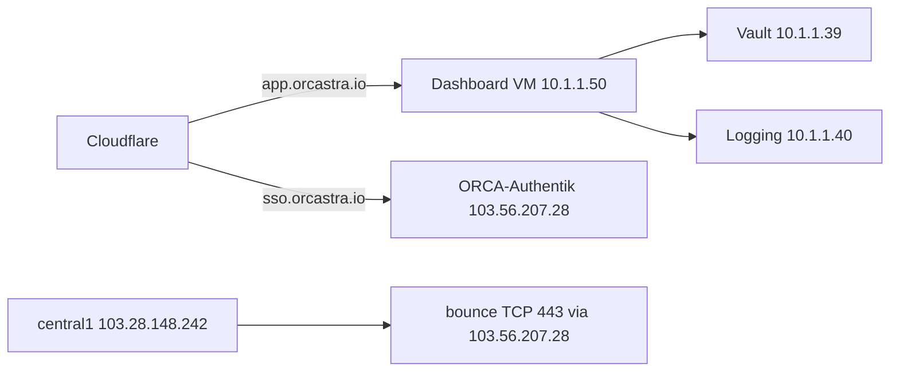

# Status produksi Jakarta

**Diverifikasi 1 Sep 2026 ~09:36 WIB.** Narasi lift-and-shift Jerman → Jakarta. Tidak ada token, unseal key, password SMTP, atau OAuth secret di halaman ini.

Lab all-in-one (Docker satu komputer) ada di [Lab: satu komputer](lab-single-host.md). Halaman ini adalah **produksi**, bukan lab.

---

## Ringkas

| | |
|---|---|
| Destinasi | Jakarta **central1** `ssh -p 3333 root@103.28.148.242` (hostname `sivali.co.id`) |
| Project LXD | `orcastra-production` |
| Jaringan | bridge `os-int-network` `10.1.1.0/24` (IP statis Jerman dipertahankan) |
| Dashboard publik | `https://app.orcastra.io` = **VM** Ubuntu `prod-orcastra-dashboard` `10.1.1.50` |
| Account Center / SSO | `https://sso.orcastra.io` = host khusus **ORCA-Authentik** `ubuntu@103.56.207.28` (bukan container `prod-authentik`) |
| Marketing | `https://orcastra.io` = situs lain (HAProxy / orcastra-landing) — **jangan dicampur** dengan app |

---

## Linimasa (fakta)

**Sumber.** Host LXD Jerman `blitzkrieg` `root@142.132.147.94`, project `ORCA-Production` (~67G: dashboard, logging, vault, authentik, exposer). Bloat di dashboard adalah Docker **vfs** (71 image sisa), bukan data aplikasi.

**Tujuan.** central1 Jakarta, project `orcastra-production`, bridge `os-int-network` `10.1.1.0/24` supaya IP statis Jerman tetap dipakai.

**Cutover ~1 Sep 2026.** Urutan: **vault → logging → dashboard**, lalu cloudflared untuk `app.orcastra.io`. Jerman **sengaja dibiarkan hidup** untuk rollback (cloudflared dashboard di Jerman di-stop/disable).

**Vault Jakarta di-init ulang** (bukan vault Jerman yang dipindah begitu saja).

- `.env` dashboard masih `VAULT_TOKEN` mengarah ke Jerman → UI kosong. Token diganti, backend di-restart.
- Postgres dashboard **sudah parity** — tidak perlu restore.
- KV Vault disalin ulang sampai **33/33 hash match**.
- Tiga folder stub API-key kosong memicu Integrations **500 `KeyError id`**; folder itu dihapus. **6 key nyata** tersisa.
- `secret/my_keys` **kosong di kedua vault** (Jakarta dan Jerman).

**Jaringan central2.** central1 **tidak bisa ARP** ke central2 `103.28.148.252` (di kertas satu `/28`, bukan L2 yang sama). Jalur yang dipakai: systemd **`central2-public-bounce`** di central1 via `ubuntu@103.56.207.28` (host Authentik) TCP **443**. Bounce ini **tetap diperlukan**. Tailscale **bukan** jalur yang dipilih.

**Dashboard harus VM, bukan container.** Sekarang: `prod-orcastra-dashboard` adalah **VIRTUAL-MACHINE** Ubuntu, `10.1.1.50`, Docker **overlayfs**. Container lama `prod-orcastra-dashboard-ct` **STOPPED** (rollback). Bounce tetap ada karena VM masih di `os-int-network`.

---

## Instance LXD (SSH 1 Sep 2026)

| NAME | TYPE | STATE | IPv4 |
|---|---|---|---|
| prod-orcastra-dashboard | VM | RUNNING | 10.1.1.50 |
| prod-orcastra-dashboard-ct | container | STOPPED | — |
| prod-vault | container | RUNNING | 10.1.1.39 |
| prod-orcastra-logging | container | RUNNING | 10.1.1.40 |
| prod-authentik | container | STOPPED | — |
| prod-exposer | VM | STOPPED | — |

!!! warning "SSO bukan container yang STOPPED"
    `prod-authentik` STOPPED **bukan** Account Center. SSO produksi = host dedicated **ORCA-Authentik** `ubuntu@103.56.207.28`, publik `https://sso.orcastra.io`, Authentik **2026.2.1** + nginx branding.

    Theme pack: [sctsivali/orcastra-authentik-theme](https://github.com/sctsivali/orcastra-authentik-theme)

Lab Docker (halaman sebelumnya) memakai Authentik **2026.8.0** — beda dari produksi SSO.

---

## Aplikasi publik — jangan dicampur

| URL | Apa |
|---|---|
| `https://app.orcastra.io` | Dashboard (VM `10.1.1.50`) |
| `https://sso.orcastra.io` | Account Center (Authentik di `103.56.207.28`) |
| `https://orcastra.io` | Situs marketing (HAProxy / orcastra-landing), **bukan** app |

---

## Arsitektur produksi (sekarang)

Alur app: Cloudflare → `app.orcastra.io` → dashboard VM `10.1.1.50` → vault `10.1.1.39` + logging `10.1.1.40`.

Alur SSO: Cloudflare → `sso.orcastra.io` → `103.56.207.28`.

central1 tidak peer L2 ke central2; bounce `central2-public-bounce` tetap hidup.

---

## Item terbuka (1 Sep 2026)

- Bounce `central2-public-bounce` **harus tetap** (bukan Tailscale).
- `prod-orcastra-dashboard-ct` **belum dihapus** (rollback).
- `prod-exposer` (VM) dan `prod-authentik` (CT) **STOPPED**.
- Host Jerman masih ada untuk rollback (dashboard cloudflared di sana stop/disable).
- Duplicate alias sertifikat central2 sempat jadi isu — jangan diasumsikan sudah bersih.

---

## Bukan halaman ini

Panduan split 4-VM (masih referensi instal): [VM 1 Authentik](vm1-authentik.md) · [VM 2 Vault](vm2-vault.md) · [VM 3 OpenSearch](vm3-opensearch.md) · [VM 4 Dashboard](vm4-dashboard.md).

Lab nubi satu laptop: [Lab Docker satu komputer](lab-single-host.md).
