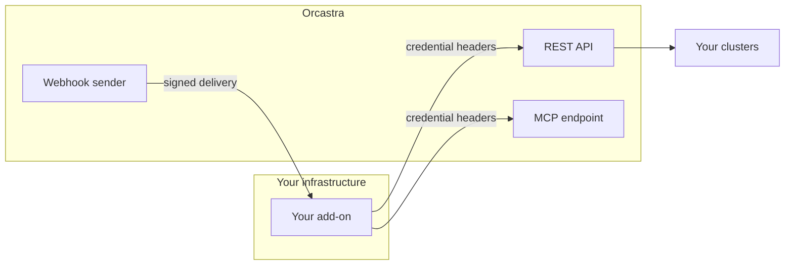

# What An Add-on Is

**An add-on is an external application you run. Orcastra issues it a credential, answers its API calls, and sends it signed events. It never runs code inside Orcastra.**

---

## The four channels

| Channel | Direction | Authenticated by |
|---|---|---|
| REST API | Add-on to Orcastra | `X-API-Key-ID` and `X-API-Key-Secret`, both required |
| MCP endpoint | Add-on to Orcastra | The same two headers, at `/api/v1/mcp` |
| Webhooks | Orcastra to add-on | HMAC signature over the raw request body |
| `GET /extensions/self` | Add-on to Orcastra | The same two headers, and the reconcile backstop |

## What runs where

Your add-on runs wherever you choose to run it. It owns its own hosting, its own uptime and its own user interface. Orcastra never executes anything you write.

That is a deliberate boundary rather than a missing feature, and it is worth being direct about the reason. Orcastra holds credentials for every cluster it manages, and the dashboard's browser origin holds an operator's session token. Code running in either place would inherit that access. Products in this category that took the other route have the security advisories to show for it, and several have since moved back.

The consequence for you is that an add-on cannot draw a panel inside the dashboard, cannot read an operator's session, and cannot reach anything the credential it was issued does not already reach.

## What an installation is

Publishing an add-on describes it. Installing it is what grants anything.

An installation binds one add-on to one organization. It carries the capabilities the operator approved and the clusters they granted, and it owns two secrets: a credential that authenticates your add-on to Orcastra, and a signing secret that lets you verify a delivery came from Orcastra. They are different values on purpose, so verifying a webhook never requires holding a credential that can act.

The same add-on installed into two organizations gets two credentials with two different reaches. Nothing about the add-on's identity grants access; only the installation does.

!!! note "Reach is recomputed, not stored"
    An installation records what an operator consented to. What it may actually do is worked out on every call from that consent, the installing partner's own access, and which clusters the organization is still bound to. If any of those narrow, the installation narrows with them, without anybody editing it.

## Who can publish and install

Publishing and installing both require the partner role. An add-on is installed into an organization the installing operator already holds, and it never receives more access than that operator has themselves.

## Next

[Build your first add-on](build-your-first-add-on.md) takes you from nothing to a working integration receiving verified webhooks.
