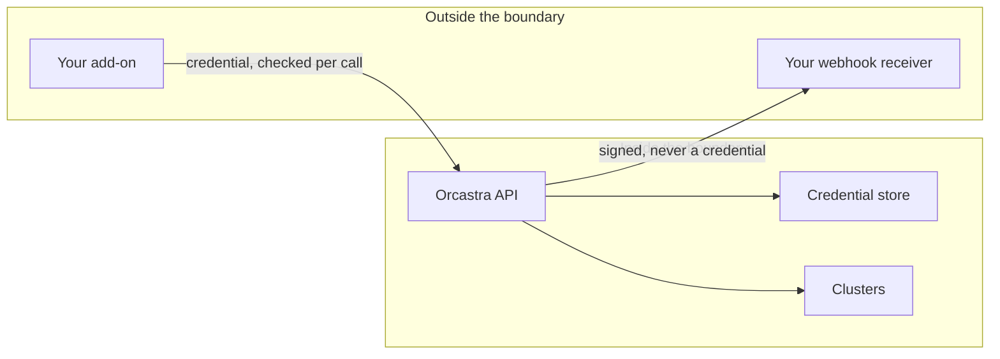

# Security Model

**An add-on is untrusted code running somewhere else, holding a credential that reaches exactly what an operator approved. This page states the boundary, and its limits.**

---

## The boundary

Everything an add-on does crosses that line as an authenticated HTTP request that is checked on arrival. Nothing an add-on writes ever executes on the trusted side.

## What an add-on can never do

- Run code inside Orcastra, or inside the dashboard's browser origin
- Read or use an operator's session
- Render a panel inside the dashboard
- Reach a cluster outside its granted list
- Hold more access than the operator who installed it
- Keep working after being suspended, uninstalled, or after its credential is rotated
- Receive guest-derived content, addresses, instance configuration or credential material in a webhook

## What Orcastra guarantees in return

**The credential is scoped and revocable.** It carries a fixed capability set and a fixed cluster list, both approved by a person. Revocation takes effect on the next call across every worker, not on a cache expiry.

**The reach is recomputed.** The stored grant records consent. What may actually be done is worked out per call from that consent, the installer's own access and the organization's current cluster bindings.

**Deliveries are signed and bounded.** HMAC-SHA256 over the raw body with a secret that is not the credential, a five-minute replay window, at-least-once with a stable event id.

**Endpoints are validated before they are stored, and again before every send.** Private, loopback, link-local and carrier-grade-NAT addresses are refused, including through a public name that resolves to one, and including the IPv6 spellings of an IPv4 address. The connection is made to the address that was checked, with the certificate still validated against the hostname, so a name that answers differently between the two does not get a connection. Redirects are not followed.

**Every grant-shaped action is audited.** Installing, re-scoping, resuming, rotating and uninstalling are recorded as high-severity administrative events naming the operator, the organization and the credential.

## The limits, stated

A security page that only lists guarantees is not one you can plan against.

**Publisher identity is not verified.** Anyone with the partner role can publish an add-on under any name. Nothing checks that "Acme Ltd" is Acme Ltd. Read who published something and why you trust them before installing it, the same as any third-party software.

**Scope drift has a window.** Suspension and uninstallation are immediate. An operator losing access to a cluster is picked up by a reconciliation pass, five minutes by default, and within that window an installation may still reach it. Suspend the installation if you need it to stop now.

**The event stream is not a complete record.** Events describe actions taken through Orcastra. Changes made directly on a cluster produce none. Reconcile against the inventory API rather than treating the stream as the only truth.

**Delivery is at-least-once.** Your receiver will see duplicates and must dedupe on the event id. There is no exactly-once mode and there is not going to be one.

**Rate limits fail open.** If the shared counter store is unavailable, the per-credential budget is not enforced and only the per-address limit applies. That is a deliberate choice, because the alternative is refusing every authenticated request during a cache outage, but it means the budget is not a hard ceiling under all conditions.

**An installation credential is a long-lived secret.** It expires after a year and can be rotated with a grace window, but between rotations it is a static value. Store it the way you store any other production credential.

## What to do if a secret leaks

Rotate the credential from the installation's page. With a grace window of zero the old one stops working immediately; with a window it keeps working for the period you choose so you can deploy first. Rotate the webhook signing secret separately, on the subscription.

If you cannot tell what happened, suspend the installation first. It stops both directions at once and is reversible.
