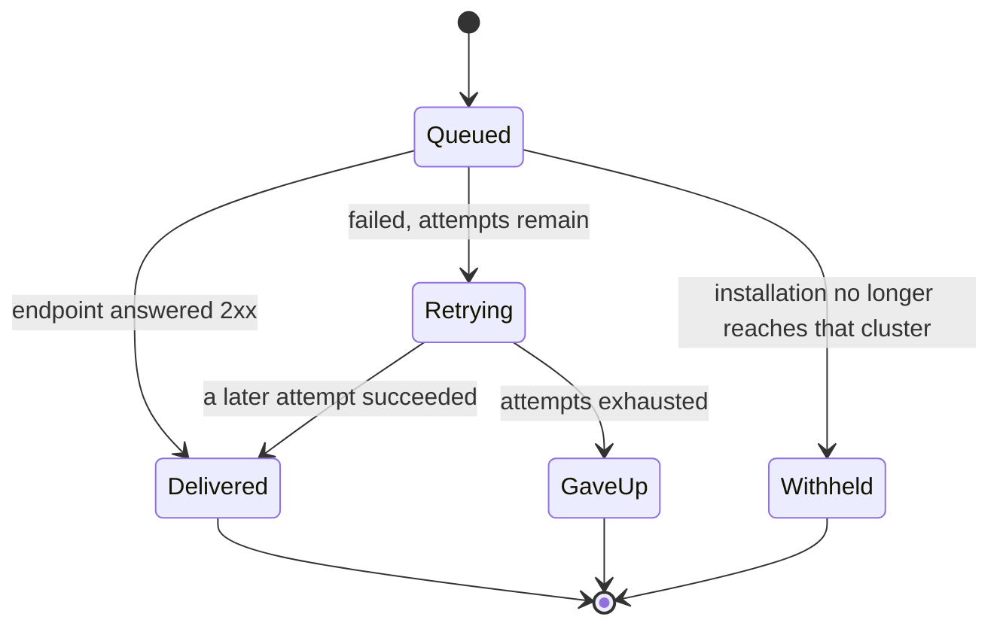

# Webhooks

**Orcastra POSTs a signed JSON envelope to an endpoint you register. Delivery is at-least-once, so your receiver must dedupe.**

---

## The event catalogue

| Event | When it fires |
|---|---|
| `orcastra.instance.created.v1` | An instance was created |
| `orcastra.instance.deleted.v1` | An instance was deleted |
| `orcastra.project.created.v1` | A project was created |
| `orcastra.project.deleted.v1` | A project was deleted |
| `orcastra.volume.created.v1` | A storage volume was created |
| `orcastra.volume.deleted.v1` | A storage volume was deleted |
| `orcastra.install.scope_changed.v1` | This installation's reach changed |
| `orcastra.install.suspended.v1` | This installation was suspended |
| `orcastra.install.resumed.v1` | This installation was resumed |

The version is in the name rather than only in the envelope, so a subscription selects one explicitly and a future `v2` is additive rather than breaking. Read the current catalogue from `GET /extensions/vocabulary`.

!!! warning "The stream is not a complete record of everything that happens"
    Events describe actions taken through Orcastra. An operator running `lxc` directly on a cluster changes the same resources and produces no event. Treat the stream as a prompt to act, not as the only source of truth, and reconcile against the inventory API periodically.

## The envelope

```json
{
  "specversion": "1.0",
  "id": "evt_0123456789abcdef",
  "type": "orcastra.instance.created.v1",
  "source": "orcastra/https://api.example.com",
  "time": "2026-09-05T10:00:00Z",
  "subscription_id": 1,
  "installation_id": 7,
  "sequence": 1757068800123,
  "data": {
    "cluster_id": "nuc2",
    "project": "tenant-a",
    "resource_type": "INSTANCE",
    "resource_name": "web-01",
    "state": "RUNNING"
  }
}
```

`id` is stable across every attempt. It is your idempotency key. `sequence` is monotonic per subscription, so a gap tells you something was not delivered rather than leaving you to infer it from silence.

### What a payload never carries

The `data` block is built from an allow-list, so these are absent by construction rather than by convention:

- anything from inside a guest, including command output, file contents, screenshots and clipboard
- IP and MAC addresses, and network device configuration
- an instance's `config` and `devices` maps
- certificates and fingerprints
- credential material of any kind
- hardware and resource figures
- anything about another organization sharing the same cluster

If you need any of that, read it through the API with a credential that was granted it. A push has no per-request permission check; a pull does.

## Headers

| Header | Meaning |
|---|---|
| `X-Orcastra-Signature` | Space-separated `v1,k=<fingerprint>:<hex>` entries |
| `X-Orcastra-Timestamp` | Unix seconds, and part of what is signed |
| `X-Orcastra-Event-Id` | Stable across attempts. Dedupe on this |
| `X-Orcastra-Delivery-Id` | Unique per attempt |
| `X-Orcastra-Event-Type` | The event name |

## Verifying

The signed material is `v1.` + the timestamp + `.` + the raw body bytes, HMAC-SHA256 with your signing secret.

Three rules, and each one is a real failure that receivers hit:

1. Verify over the **raw body**, before parsing. Re-serialised JSON produces different bytes.
2. Compare in **constant time**.
3. Reject a timestamp more than **300 seconds** from now, or a captured delivery replays forever.

Working code in both languages is in [the tutorial](build-your-first-add-on.md#6-verify-the-signature).

Accept the delivery if **any** entry in the signature header verifies. During a secret rotation both are sent, which is what lets you switch on your own schedule.

## Delivery lifecycle



| Behaviour | Value |
|---|---|
| Attempts | 5 |
| Backoff | about 10s, 1m, 5m, 15m, 30m, jittered |
| Given up after | roughly 50 minutes |
| Endpoint suspended after | 20 consecutive failures |
| Response deadline | 10 seconds |
| Response body read | first 64 KB, then the connection is closed |

Answer `2xx` quickly and work afterwards. A slow success holds a connection for as long as you take.

**Withheld** means the delivery was never sent, because the installation stopped reaching that cluster between the event happening and the delivery going out. It is the revocation working rather than an outage.

## Endpoint requirements

`https`, publicly resolvable, and not an address inside the deployment's own network. Private, loopback, link-local and carrier-grade-NAT ranges are refused, including when a public name resolves to one. Redirects are not followed: a receiver controls the URL it registered, so a redirect is treated as a delivery failure.

The connection is made to the address that was checked, and the certificate is still validated against your hostname, so a name that answers differently between the check and the connection does not get a connection either.
