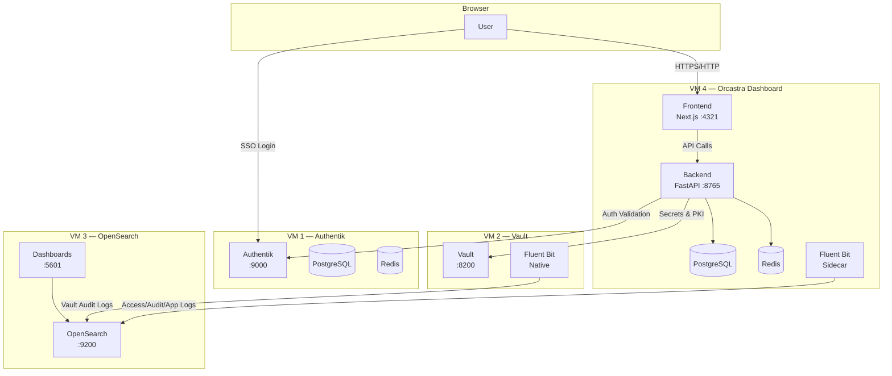
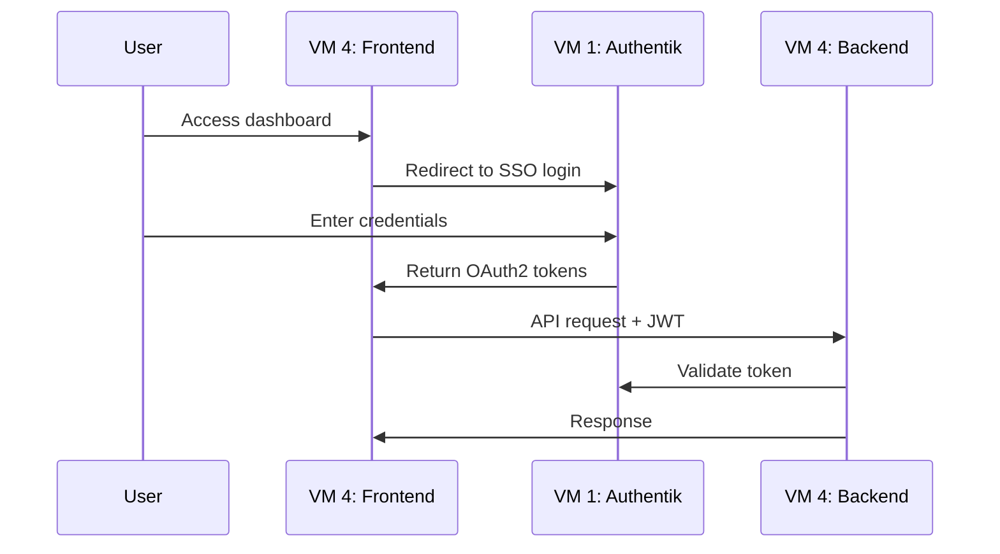
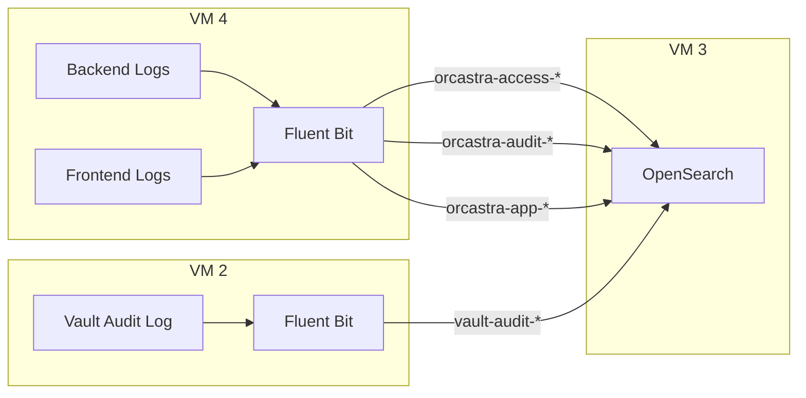

# Architecture Overview

This page describes the high-level architecture of the Orcastra platform, including component interactions, data flow, and network topology.

## System Architecture



## Component Responsibilities

### VM 1 — Authentik (Identity Provider)

- **Role:** Single Sign-On (SSO) and identity management
- **Protocol:** OAuth2/OpenID Connect
- **Key Functions:**
    - User authentication and session management
    - Role group management (`role_admin`, `role_partner`, `role_tenant`)
    - API token issuance for automated group sync
- **Technology:** Authentik (Docker), PostgreSQL, Redis

### VM 2 — Vault (Secret Management)

- **Role:** Secret storage and PKI certificate authority
- **Key Functions:**
    - KV v2 secret engine for cluster credentials
    - PKI intermediate CA for TLS certificate issuance
    - Audit logging forwarded to OpenSearch via Fluent Bit
- **Technology:** HashiCorp Vault (native), Fluent Bit (native)

### VM 3 — OpenSearch (Logging & Analytics)

- **Role:** Centralized log aggregation and dashboards
- **Key Functions:**
    - Receives logs from VM 2 (Vault audits) and VM 4 (application logs)
    - Pre-built dashboards: Access Logs, Audit Logs, Logs Overview, Vault Audit
    - Index lifecycle management with retention policies
- **Technology:** OpenSearch (Docker), OpenSearch Dashboards (Docker)

### VM 4 — Orcastra Dashboard (Application)

- **Role:** The main web application and API backend
- **Key Functions:**
    - Multi-cluster LXD management UI
    - REST API for cluster operations, user management, and reporting
    - Fluent Bit sidecar for structured log shipping
- **Technology:** Next.js (Frontend), FastAPI (Backend), PostgreSQL, Redis, Fluent Bit (Docker)

## Data Flow

### Authentication Flow



### Logging Pipeline



### Log Index Retention

| Index Pattern | Source | Retention |
|---|---|---|
| `orcastra-access-*` | HTTP access logs | 90 days |
| `orcastra-audit-*` | Activity & audit events | 3 years |
| `orcastra-app-*` | Application logs | 30 days |
| `vault-audit-*` | Vault operations | 30 days |

## Network Topology

```
┌─────────────────────────────────────────────────────────────┐
│                      LXD Host Server                        │
│                                                             │
│  ┌──────────┐  ┌──────────┐  ┌──────────┐  ┌──────────┐   │
│  │  VM 1    │  │  VM 2    │  │  VM 3    │  │  VM 4    │   │
│  │ Authentik│  │  Vault   │  │OpenSearch│  │Dashboard │   │
│  │  :9000   │  │  :8200   │  │:9200/:5601│ │:4321/:8765│  │
│  └────┬─────┘  └────┬─────┘  └────┬─────┘  └────┬─────┘   │
│       │              │              │              │         │
│       └──────────────┴──────────────┴──────────────┘         │
│                    LXD Bridge Network                        │
└─────────────────────────────────────────────────────────────┘
                           │
                    Port Forwarding
                           │
                    ┌──────┴──────┐
                    │   Internet  │
                    │  / Browser  │
                    └─────────────┘
```

## RBAC Model

| Role | Group | Access Level |
|---|---|---|
| **Admin** | `role_admin` | Full system-wide access — all clusters, users, settings |
| **Partner** | `role_partner` | Cluster owner — manages own clusters, organizations, tenants |
| **Tenant** | `role_tenant` | End user — access to assigned projects only |

Each user belongs to exactly one role group in Authentik. If assigned to multiple groups, the highest-privilege role takes effect.
