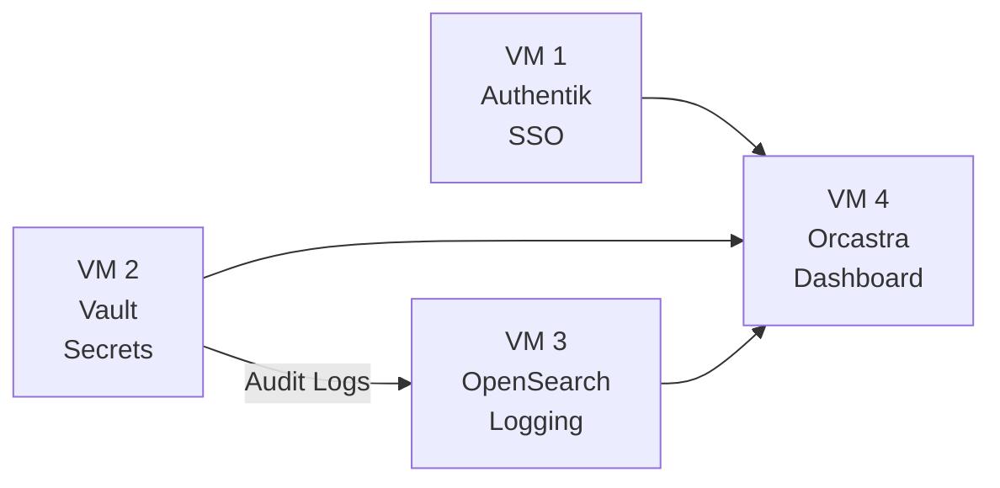

# Getting Started

Welcome to the Orcastra platform deployment documentation. This section covers everything you need to know before deploying the system.

## What is Orcastra?

Orcastra is an operations center dashboard designed for organizations managing multi-cluster LXD infrastructure. It provides:

- **Centralized Management** — Manage multiple LXD clusters, containers, and virtual machines from a single dashboard
- **Identity & Access Management** — SSO authentication with role-based access control (Admin, Partner, Tenant)
- **Secret Management** — Secure credential storage and PKI certificate management via HashiCorp Vault
- **Audit & Compliance** — Comprehensive audit logging with 3-year retention for regulatory compliance
- **Real-time Monitoring** — Access logs, performance metrics, and operational dashboards via OpenSearch

## Deployment Overview

The platform is deployed across four virtual machines in an on-premises LXD environment:

## Sections

-   **[Prerequisites](prerequisites.md)**

    Hardware, software, and account requirements.

-   **[Architecture Overview](architecture.md)**

    System design, data flow, and component interactions.

-   **[Quick Start](quick-start.md)**

    Condensed checklist for experienced administrators.

