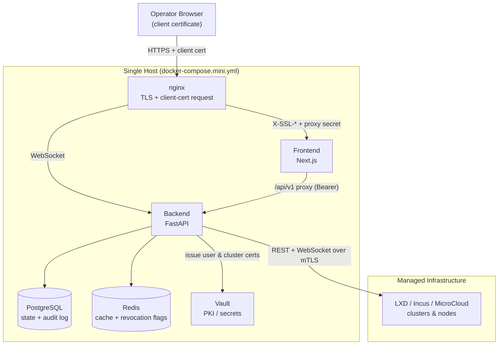

# Architecture

Orcastra Mini runs every service on a single host with Docker Compose. The only port
published to the host is the nginx HTTPS port; the frontend, backend, and Vault are reachable
only on the internal Docker network (Vault is additionally bound to loopback).

## Topology

## Request path

1. The browser connects to nginx over HTTPS and presents its imported client certificate.
2. nginx terminates TLS, requests the certificate (`ssl_verify_client optional_no_ca`,
   trust-on-first-use), and forwards the verified certificate to the frontend as `X-SSL-*`
   headers together with a shared proxy secret.
3. The frontend's NextAuth Credentials provider exchanges those headers at the backend
   (`/api/v1/auth/cert-login`). The backend recomputes the SHA-256 fingerprint, maps it to a
   local identity and role, and mints a short-lived session token (HS256).
4. Every other API call carries that token as a normal `Authorization: Bearer`; the frontend
   API proxy re-issues requests to the backend server-side. WebSocket traffic (console,
   terminal, monitoring) is routed by nginx directly to the backend.

!!! note "Why a token bridge"
    Only the source of the token changes between the two profiles. The certificate is verified
    at login and exchanged for a session token; the rest of the application (RBAC, bearer
    tokens, websockets) is identical to the full version, which keeps the blast radius small.

## Components

| Service | Role | Host exposure |
|---|---|---|
| nginx | TLS termination, requests the client certificate, single entry point | Published (`HTTPS_PORT`, default 6969) |
| Frontend (Next.js) | UI and the certificate login bridge | Docker network only |
| Backend (FastAPI) | API, RBAC, certificate issuance, audit, LXD/Incus driver | Docker network only |
| PostgreSQL | Application state and the audit log | Docker network only |
| Redis | Response cache and session-revocation flags | Docker network only |
| Vault | PKI for user and cluster certificates, secret storage | Loopback only (`127.0.0.1:8200`) |

## Ports

| Service | Port | Exposure |
|---|---|---|
| nginx (HTTPS) | `6969` | Published to the host (the only public port) |
| Frontend | `2025` | Docker network only |
| Backend | `4050` | Docker network only |
| Vault | `8200` | Loopback only |

The public port is set with `HTTPS_PORT` in `.env`. Choose a port that does not collide with
other services on the host (for example, the LXD UI uses 8443).

## Security model

- **Header trust boundary.** nginx overwrites the `X-SSL-*` headers from the real TLS layer,
  so a browser cannot forge them. The backend honours those headers only when the shared
  `AUTH_PROXY_SECRET` matches (and, optionally, the caller is inside `TRUSTED_AUTH_PROXY_CIDRS`).
  The generic API proxy strips them, and the backend port is never published.
- **Identity from the fingerprint.** The identity is the SHA-256 fingerprint of the presented
  certificate, recomputed server-side. The role comes from the local identity store, never
  from the certificate subject, so a self-signed `CN=admin` cannot escalate.
- **Revocation at the application layer.** `optional_no_ca` does not consult a CRL, so
  revocation is enforced per request through a Redis flag. A revoked or role-changed identity
  is rejected on its next request regardless of the token's own lifetime.
- **No default-grant.** An authenticated identity that maps to no role is denied, not treated
  as a tenant.
- **Tamper-evident audit.** The audit log is append-only and hash-chained; `/audit-log/verify`
  recomputes the chain and also detects tail truncation against a stored high-water mark.

See [Certificate Authentication](certificate-auth.md) for the enrollment and session details,
and [Operations](operations.md) for verifying the audit chain.
