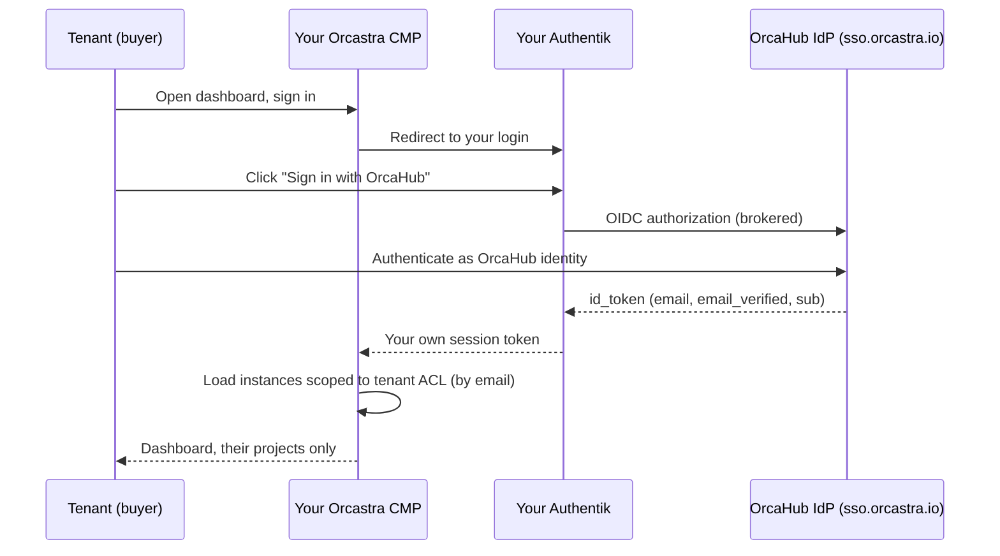

# OrcaHub Federation (Partner SSO)

**Let your tenants sign in to your Orcastra CMP with their existing OrcaHub identity, without issuing them a separate password.**

When you sell compute through the OrcaHub marketplace, a buyer purchases on OrcaHub and then opens your Orcastra CMP to operate their instances. Your dashboard already knows what that buyer may access: OrcaHub pushes their project entitlement to your dashboard at purchase time, keyed by email. What is missing is authentication, because your identity provider has never seen that user. Their account lives in OrcaHub's identity provider, not yours.

Federation closes that gap. You configure your Authentik to trust OrcaHub's identity provider as an upstream OIDC source. The buyer clicks **Sign in with OrcaHub**, authenticates once against OrcaHub, and lands in your dashboard scoped to exactly their own projects. This is a one-time setup per partner.

---

## How it works



The entitlement (which projects the tenant may see) is delivered separately by OrcaHub's integration API at purchase time and is keyed by **email**. Federation only carries identity. The tenant's email in the federated token must match the email OrcaHub provisioned. That is the join key.

---

## What OrcaHub provides

Before you start, request an OrcaHub federation client. OrcaHub registers a dedicated OIDC client for your deployment and gives you:

| Value | Used as |
|---|---|
| Client ID | Consumer key on your OAuth source |
| Client Secret | Consumer secret on your OAuth source |
| Discovery URL | `https://sso.orcastra.io/application/o/<your-client>/.well-known/openid-configuration` |
| Callback URL | The redirect your source must expose: `https://<your-authentik-host>/source/oauth/callback/<slug>/` |

!!! warning "The slug is load-bearing"
    The **slug** of the OAuth source you create below must match the `<slug>` in the callback URL that OrcaHub registered for your client. If they differ, the login fails with `redirect_uri mismatch`. Agree on the slug with OrcaHub up front (for example, `orcahub`).

---

## Step 1: Create the OAuth source

In your Authentik admin, go to **Directory -> Federation and Social login -> Create -> OpenID Connect OAuth Source**.

| Field | Value |
|---|---|
| Name | `OrcaHub` (shown on the login button) |
| Slug | must match the callback, for example `orcahub` |
| Enabled | on |
| User matching mode | **Link to a user with identical email address** |
| Consumer key | your Client ID from OrcaHub |
| Consumer secret | your Client Secret from OrcaHub |
| OIDC Well-known URL | the discovery URL from OrcaHub |
| Scopes | `openid email profile` |
| Authentication flow | `default-source-authentication` |
| Enrollment flow | `default-source-enrollment` |

!!! note "Why email matching, not unique identifier"
    A tenant who already exists in your Authentik (same email) must be *linked*, not duplicated. "Link to a user with identical email address" links them on first sign-in; Authentik then pins the connection to the upstream `sub` for later logins. This is safe here because the `email_verified` gate in Step 2 ensures only OrcaHub-verified emails can link.

If the well-known URL cannot be fetched, fill the four endpoints manually from the discovery document: Authorization URL (`.../application/o/authorize/`), Access token URL (`.../application/o/token/`), Profile URL (`.../application/o/userinfo/`), and OIDC JWKS URL (`.../<your-client>/jwks/`).

---

## Step 2: Require a verified email (trust gate)

OrcaHub authorizes tenants by email, so you must only accept identities whose email OrcaHub has verified. Enforce this with a policy.

### 2a. Create the policy

Go to **Customization -> Policies -> Create -> Expression Policy**:

- **Name:** `orcahub-require-verified-email`
- **Expression:**

```python
userinfo = request.context.get("oauth_userinfo", {})
return userinfo.get("email_verified", False) is True
```

!!! tip "Confirm the claim key for your version"
    The userinfo key can vary between Authentik versions. Enable **Execution logging** on the policy and watch **Events -> Logs** during your first test login. If `email_verified` is not under `oauth_userinfo`, adjust the expression to match where the claim lands (use the flow inspector by appending `?inspector` to the flow URL).

### 2b. Bind it to the source flows

Bind the policy to **both** flows so it gates every federated login, not only first-time enrollment:

1. **Flows and Stages -> Flows -> `default-source-enrollment` -> Policy / Group / User Bindings -> Bind existing policy**, select `orcahub-require-verified-email`, Order `0`, Failure result **Don't pass**.
2. Repeat for **`default-source-authentication`**.

!!! danger "Fail closed"
    Keep Failure result on **Don't pass**. An identity that does not present `email_verified: true` is denied, not admitted.

---

## Step 3: Show the sign-in button

The source appears on your login page as a button once it is added to the identification stage.

1. **Flows and Stages -> Stages -> `default-authentication-identification` -> edit**.
2. Under **Source settings -> Sources**, move **OrcaHub** into **Selected Sources**.
3. Enable **Show sources' labels** so the button reads "OrcaHub" instead of a bare icon.
4. (Optional) Set a custom icon on the source (**Federation and Social login -> OrcaHub -> Icon**).

---

## Step 4: Test

Use a fresh private or incognito window for each test.

**Positive, a verified tenant is admitted:**

1. Open your dashboard, choose **Sign in with OrcaHub**.
2. Authenticate as a tenant whose OrcaHub email is verified and who has purchased from you.
3. You should land in the dashboard and see **only that tenant's projects**.

**Negative, an unverified identity is denied:**

1. Repeat with an identity whose email OrcaHub has *not* verified.
2. Enrollment should stop with **Request denied**, and the policy execution log shows `passing: false`.

!!! success "What a correct result looks like"
    Verified tenant: lands in the dashboard, sees only their own instances (tenant ACL, by email). Unverified identity: blocked before any dashboard access.

---

## Trust model

- **Authorization is by email.** OrcaHub pushes each tenant's project ACL to your dashboard keyed by email, and your dashboard scopes a tenant to only those projects. Federation must deliver the *same* email.
- **The verified-email gate is the security boundary.** Linking accounts by email is only safe when the email is verified by the upstream. OrcaHub emits `email_verified: true` only for genuinely verified accounts, and your policy rejects anything else. Both sides enforce it (defense in depth).
- **Identity is pinned to `sub` after the first link.** Email establishes the first link; subsequent logins match on the immutable upstream subject, so a later email change cannot silently re-point the account.

---

## Using a different identity provider

The same pattern works with any OIDC-capable IdP (Keycloak, Okta, Azure AD, Zitadel). The concept is identical: register OrcaHub as an upstream **OIDC identity provider or connection** in your IdP, with:

- Client ID, client secret, and discovery URL from OrcaHub
- Scopes `openid email profile`
- Claim mapping for `email` and `email_verified`
- Account linking by verified email, and a rule that **denies** login when `email_verified` is not true

The one invariant across every IdP: the `email` in the federated token must equal the email OrcaHub provisioned for that tenant, because the dashboard's access control joins on it.

---

## Troubleshooting

| Symptom | Cause | Fix |
|---|---|---|
| `Request denied - Failed to update user` | The tenant already exists in your Authentik and matching mode is "unique identifier", so enrollment tries to create a duplicate | Set **User matching mode** to **Link to a user with identical email address** |
| `redirect_uri mismatch` at OrcaHub | Source slug does not match the callback OrcaHub registered | Make the source slug match the `<slug>` in your callback URL |
| The login button is a blank icon | "Show sources' labels" is off | Enable it on the identification stage (Step 3) |
| A verified tenant is denied | The `email_verified` claim is not reaching the policy | Check the policy execution log, confirm OrcaHub emits `email_verified: true`, and adjust the claim key if your Authentik version differs |
| Tenant lands but sees no instances | No entitlement for that email, or an email mismatch | Confirm the purchase provisioned access and that the federated email matches the provisioned email |

---

## Related

- [VM 1 - Authentik (SSO)](../deployment/vm1-authentik.md) for the base Authentik setup and role groups
- [ORCA Agent Installer](orca-agent-install.md) to connect a cluster to OrcaHub
- [Security Model](../architecture/security.md)
