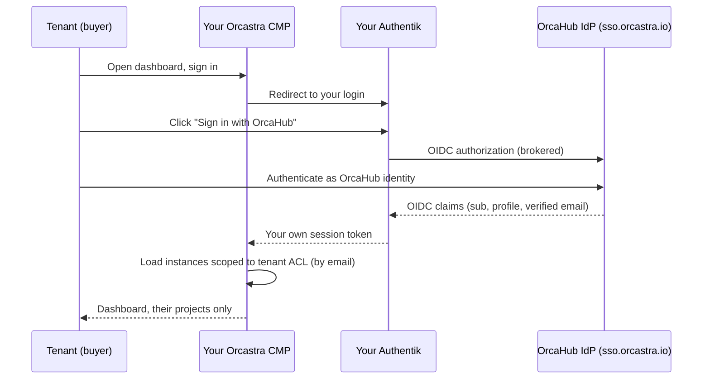

# OrcaHub Federation (Partner SSO)

**Let your tenants sign in to your Orcastra CMP with their existing OrcaHub identity, without issuing them a separate password.**

When you sell compute through the OrcaHub marketplace, a buyer purchases on OrcaHub and then opens your Orcastra CMP to operate their instances. Your dashboard already knows what that buyer may access: OrcaHub pushes their project entitlement to your dashboard at purchase time, keyed by email. What is missing is authentication, because your identity provider has never seen that user. Their account lives in OrcaHub's identity provider, not yours.

Federation closes that gap. You configure your Authentik to trust OrcaHub's identity provider as an upstream OIDC source. The buyer clicks **Sign in with OrcaHub**, authenticates once against OrcaHub, and lands in your dashboard scoped to exactly their own projects. This is a one-time setup per partner.

---

## How it works


```mermaid
sequenceDiagram
    participant T as Tenant (buyer)
    participant D as Your Orcastra CMP
    participant PA as Your Authentik
    participant OA as OrcaHub IdP (sso.orcastra.io)
    T->>D: Open dashboard, sign in
    D->>PA: Redirect to your login
    T->>PA: Click "Sign in with OrcaHub"
    PA->>OA: OIDC authorization (brokered)
    T->>OA: Authenticate as OrcaHub identity
    OA-->>PA: OIDC claims (sub, profile, verified email)
    PA-->>D: Your own session token
    D->>D: Load instances scoped to tenant ACL (by email)
    D-->>T: Dashboard, their projects only
```

The entitlement (which projects the tenant may see) is delivered separately by OrcaHub's integration API at purchase time and is keyed by **email**. Federation only carries identity. The tenant's email in the federated token must match the email OrcaHub provisioned. That is the join key.

Group membership is deliberately not federated. The partner Authentik remains authoritative for local `role_admin`, `role_partner`, and `role_tenant` membership.

---

## What OrcaHub provides

Before you start, request an OrcaHub federation client. OrcaHub registers a dedicated OIDC client for your deployment and gives you:

| Value | Used as |
|---|---|
| Client ID | Consumer key on your OAuth source |
| Client Secret | Consumer secret on your OAuth source |
| Discovery URL | `https://sso.orcastra.io/application/o/<your-client>/.well-known/openid-configuration` |
| Callback URL | The redirect your source must expose: `https://<your-authentik-host>/source/oauth/callback/<slug>/` |

!!! warning "The slug is load-bearing"
    This guide standardizes the source slug as `orcahub`. The callback registered on OrcaHub and the verified-email policy below both depend on that exact value. If an existing deployment uses another slug, replace the literal `orcahub` in the policy expression with the exact deployed slug before enabling the source.

### OrcaHub-side scope requirements

The dedicated OAuth2/OpenID provider on OrcaHub must expose exactly these logical scopes:

- the managed `openid` mapping;
- a dedicated `profile` mapping that does **not** emit `groups`; and
- a verified-aware `email` mapping that returns `email` and a literal Boolean `email_verified` from an authoritative verification state.

Do not select Authentik's managed `profile` mapping for this provider. It includes every upstream group name. A Generic OpenID Connect source automatically imports that claim and attempts to synchronize the groups locally. If the partner already has a local role group such as `role_partner`, authentication then fails with a duplicate group-name constraint. Linking same-named groups would be worse because an upstream claim could grant a local privileged role.

Create a dedicated **Scope Mapping** on OrcaHub:

| Field | Value |
|---|---|
| Name | `Partner federation - Profile without groups` |
| Scope name | `profile` |
| Description | `Basic profile claims without federating group membership.` |

Use this expression:

```python
return {
    "name": request.user.name,
    "given_name": request.user.name,
    "preferred_username": request.user.username,
    "nickname": request.user.username,
}
```

On the partner-specific OAuth2/OpenID provider, remove the managed `profile` mapping and select this dedicated mapping. Also remove Authentik's managed `email` mapping when the verified-aware email mapping is selected, because the managed mapping emits a conflicting `email_verified` value.

The final provider selection should contain one mapping for each requested scope:

```text
authentik default OAuth Mapping: OpenID 'openid'
Partner federation - Profile without groups
OrcaHub Federation: email (verified-aware)
```

!!! danger "Do not federate role groups"
    Do not delete or rename an existing local role group to work around a collision. Do not configure group matching to link identical names. Authorization remains local to the partner deployment.

---

## Step 1: Create the OAuth source

In your Authentik admin, go to **Directory -> Federation and Social login -> Create -> OpenID Connect OAuth Source**.

| Field | Value |
|---|---|
| Name | `OrcaHub` (shown on the login button) |
| Slug | `orcahub`; it must match the registered callback and the Step 2 policy |
| Enabled | on |
| User matching mode | **Link to a user with identical email address** |
| Consumer key | your Client ID from OrcaHub |
| Consumer secret | your Client Secret from OrcaHub |
| OIDC Well-known URL | the discovery URL from OrcaHub |
| Scopes | leave blank; the Generic OpenID Connect source requests `openid email profile` by default |
| Authentication flow | `default-source-authentication` |
| Enrollment flow | `default-source-enrollment` |

!!! note "Why email matching, not unique identifier"
    A tenant who already exists in your Authentik (same email) must be *linked*, not duplicated. "Link to a user with identical email address" links them on first logged-out sign-in; Authentik then pins the connection to the upstream `sub` for later logins. The `email_verified` gate in Step 2 protects this authentication and enrollment path.

If the well-known URL cannot be fetched, fill the four endpoints manually from the discovery document: Authorization URL (`.../application/o/authorize/`), Access token URL (`.../application/o/token/`), Profile URL (`.../application/o/userinfo/`), and OIDC JWKS URL (`.../<your-client>/jwks/`).

---

## Step 2: Require a verified email (trust gate)

OrcaHub authorizes tenants by email, so you must only accept identities whose email OrcaHub has verified. Enforce this with a flow-level policy.

### 2a. Create the policy

Go to **Customization -> Policies -> Create -> Expression Policy**:

- **Name:** `OrcaHub - Require verified email`
- **Expression:**

```python
source = context.get("source")

if source is None:
    ak_message("Sign-in denied: identity source is missing.")
    return False

# The default source flows can be shared with other identity providers.
# This literal must equal the configured OrcaHub source slug exactly.
if getattr(source, "slug", None) != "orcahub":
    return True

userinfo = context.get("oauth_userinfo")
if not isinstance(userinfo, dict):
    ak_message("OrcaHub sign-in requires a verified email address.")
    return False

email = userinfo.get("email")
if (
    isinstance(email, str)
    and email.strip()
    and userinfo.get("email_verified") is True
):
    return True

ak_message("OrcaHub sign-in requires a verified email address.")
return False
```

The strict `is True` comparison fails closed when the claim is absent, false, or encoded as a string. Keep policy execution logging disabled during normal operation and never log the complete OAuth userinfo object, because it contains personal identity claims.

### 2b. Bind it to the source flows

First open **Directory -> Federation and Social login -> OrcaHub -> Edit** and note the exact Authentication flow and Enrollment flow selected on the source.

For each distinct flow:

1. Go to **Flows and Stages -> Flows**, open the flow, and inspect **Policy / Group / User Bindings**.
2. Edit the flow and set **Policy engine mode** to **ALL**. With `ANY`, an existing passing `*-if-sso` policy could bypass the verified-email gate.
3. Under **Policy / Group / User Bindings**, bind `OrcaHub - Require verified email` with Order `10`, Enabled on, Negate off, and Failure result **Don't pass**.
4. Repeat for the other source flow. If both source settings point to the same flow, bind the policy only once.

!!! danger "Bind to the flow, not a stage"
    Bind this policy through the flow's **Policy / Group / User Bindings** tab. Do not bind it to an individual stage. A failing stage policy can skip that stage instead of denying the complete source flow.

If a shared source flow has custom policies beyond Authentik's default `*-if-sso` binding, review their intended AND/OR behavior before changing the engine mode.

!!! note "Manual account linking is a separate path"
    These flow bindings protect logged-out source authentication and enrollment. Authentik can handle an explicit source-link action from an already authenticated session without running these source flows. Do not treat this policy as validation for manual account linking. Disable or separately restrict that capability if users do not need it.

---

## Step 3: Show the sign-in button

The source appears on your login page after it is added to the Identification stage used by the active Brand.

1. Go to **System -> Brands**, open the Brand for your Authentik hostname, and note its Authentication flow.
2. Go to **Flows and Stages -> Flows** and open that Authentication flow (commonly `default-authentication-flow`).
3. Open **Stage Bindings**, locate the Identification stage (commonly `default-authentication-identification`), and choose **Edit Stage**.
4. Under **Source settings**, move **OrcaHub** into **Selected Sources**.
5. Enable **Show source labels** so the button reads "OrcaHub" instead of showing only an icon.
6. Optionally set a custom icon under **Directory -> Federation and Social login -> OrcaHub -> Edit -> Icon**.

---

## Step 4: Test

Use a completely fresh private or incognito session after every provider-scope change. Do not continue a failed source-flow tab because its mapped claims, including source groups, were captured when that flow was created.

**Positive, a verified tenant is admitted:**

1. Open your dashboard, choose **Sign in with OrcaHub**.
2. Authenticate as a tenant whose OrcaHub email is verified and who has purchased from you.
3. You should land in the dashboard and see **only that tenant's projects**.
4. Repeat the login and confirm that Authentik does not create a duplicate user.

**Negative, an unverified identity is denied:**

1. Repeat with an identity whose email OrcaHub has *not* verified, or whose `email_verified` claim is absent.
2. Enrollment or authentication must stop with **Request denied**.

**Group isolation:**

1. Confirm the login does not create or link any local `role_*` group from the upstream claims.
2. Confirm the user retains only the local memberships deliberately assigned by the partner administrator.

!!! success "What a correct result looks like"
    A verified tenant lands in the dashboard and sees only their own instances. An unverified identity is blocked before dashboard access. No upstream group name is imported into local RBAC.

---

## Trust model

- **Authorization is by email.** OrcaHub pushes each tenant's project ACL to your dashboard keyed by email, and your dashboard scopes a tenant to only those projects. Federation must deliver the *same* email.
- **The verified-email gate is the security boundary for logged-out federation.** Linking during source authentication or enrollment is only safe when the upstream sends a literal Boolean `email_verified: true` from an authoritative verification state and the partner policy rejects every other value. Manual linking from an existing authenticated session is a separate control path.
- **Identity is pinned to `sub` after the first link.** Email establishes the first link; subsequent logins match on the immutable upstream subject, so a later email change cannot silently re-point the account.
- **Local RBAC remains local.** OrcaHub group membership is not imported. Partner administrators assign local Admin, Partner, or Tenant roles independently of upstream group names.

---

## Using a different identity provider

The same pattern works with any OIDC-capable IdP (Keycloak, Okta, Azure AD, Zitadel). The concept is identical: register OrcaHub as an upstream **OIDC identity provider or connection** in your IdP, with:

- Client ID, client secret, and discovery URL from OrcaHub
- Scopes `openid email profile`
- Claim mapping for `email` and a literal Boolean `email_verified`
- No automatic import or same-name linking of upstream groups into local privileged groups
- Account linking by verified email, and a rule that **denies** login when `email_verified` is not true

The invariant across every IdP is that the federated `email` must equal the email OrcaHub provisioned for that tenant. The partner IdP, not OrcaHub group claims, remains authoritative for local roles.

---

## Troubleshooting

| Symptom | Cause | Fix |
|---|---|---|
| `duplicate key value violates unique constraint ... group_name ...` for a local `role_*` group | The OrcaHub provider is using Authentik's managed `profile` mapping, which exports upstream group names; the partner source then tries to create the same group locally | Replace the managed `profile` mapping on the dedicated OrcaHub provider with the no-groups profile mapping. Do not delete the local group or enable same-name group linking. Start a completely new private session afterward. |
| `Request denied - Failed to update user` | The tenant already exists in your Authentik and matching mode is "unique identifier", so enrollment tries to create a duplicate | Set **User matching mode** to **Link to a user with identical email address** |
| `redirect_uri mismatch` at OrcaHub | Source slug does not match the callback OrcaHub registered | Make the source slug match the `<slug>` in your callback URL |
| The login button is missing or is a blank icon | The wrong Brand authentication flow was edited, the source is not selected, or source labels are hidden | Find the active flow under **System -> Brands**, edit its Identification stage, select OrcaHub, and enable source labels |
| Every verified tenant is denied | The verified-aware email mapping is missing, both the managed and custom `email` mappings are selected, or `email_verified` is not a Boolean `true` | Keep only the managed `openid`, no-groups `profile`, and verified-aware `email` mappings on the dedicated provider; verify the claim without logging tokens or the complete userinfo object |
| Tenant lands but sees no instances | No entitlement for that email, an email mismatch, or no deliberate local role assignment | Confirm the purchase provisioned access, the federated email matches the provisioned email, and the partner assigned the intended local role |

---

## Related

- [VM 1 - Authentik (SSO)](../deployment/vm1-authentik.md) for the base Authentik setup and role groups
- [ORCA Agent Installer](orca-agent-install.md) to connect a cluster to OrcaHub
- [Security Model](../architecture/security.md)
